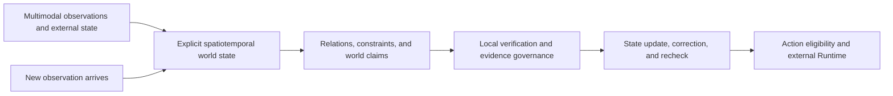

# GeoTask

[简体中文](README.md) | **English**

**Explicit and verifiable spatiotemporal world model for AI agents.**

> Let foundation models understand the world; let GeoTask verify and maintain it.

[](LICENSE)
[](https://www.python.org/)
[](https://github.com/stpku/GeoTask/actions/workflows/ci.yml)
[](https://stpku.github.io/GeoTask/)
[](https://github.com/stpku/GeoTask/releases)
[](https://pypi.org/project/geotask-core/)

```bash
pip install geotask-core
```

GeoTask turns multimodal models, sensors, maps, authoritative data, and human input into explicit world objects, spatiotemporal relations, state, evidence, and action constraints. It builds a world state that is computable, verifiable, updatable, and traceable. Rather than hiding the whole world inside a neural representation, GeoTask makes the facts an agent depends on inspectable, recomputable, correctable, and maintainable.

- **Multimodal models perceive and reason openly:** observations, hypotheses, explanations, and plans from text, maps, imagery, video, and state data.
- **GeoTask Core provides world-state contracts and a verification kernel:** explicit objects, coordinates, time, relations, evidence, and claims with local deterministic verification.
- **Verification and control maintain the world:** preserve supported facts, expose conflict and unknown states, constrain correction, and manage action eligibility.
- **Runtimes and Domain Packs connect reality:** authoritative data, industry rules, local predictive models, human review, and production actions.

> **Engineering boundary:** GeoTask Core provides the public state contracts, verification kernel, and Artifact foundation of a verifiable spatiotemporal world model. The verifiable task protocol is the current implementation form. Observation v0.1 carries source-bound claims, World State v0.1 records versioned snapshots, Observation Merge Result v0.1 applies complete explicit claim mappings to existing state targets, supports caller-declared semantic-equality consolidation or complete precedence for claims targeting the same path, and emits a bound successor revision, State Transition v0.1 binds before/after states, Verification Session v0.1 freezes audit context, Discrepancy Report v0.1 records bounded differences, Correction Request v0.1 constrains successor-state changes, Impact Graph v0.1 represents the affected topology, Recompute Derivation Result v0.1 deterministically derives bounded values from exact source paths, World State Materialization Result v0.1 records bounded successor materialization, and Incremental Reevaluation Result v0.1 closes graph-node, target, acceptance, discrepancy, and output/action-gate outcomes. Automatic diff computation, identity discovery, resolution of ambiguous claims without a declared policy, automatic graph discovery/propagation execution, and general-purpose derivation methods remain under development.

## Start here

- [Try the GT01–GT22 experience](https://stpku.github.io/GeoTask/)
- [Quickstart](docs/tutorials/quickstart.md)
- [White Paper v0.1](docs/whitepaper/GeoTask_White_Paper_v0.1.md)
- [White paper English abstract](docs/whitepaper/GeoTask_White_Paper_v0.1.md#english-abstract)
- [Implemented Language and Execution Specification v1.0](docs/spec/geotask-language-spec-v1.0.md)
- [GeoTask Observation v0.1](docs/spec/geotask-observation-v0.1.md)
- [GeoTask World State v0.1](docs/spec/geotask-world-state-v0.1.md)
- [GeoTask Observation Merge Result v0.1](docs/spec/geotask-observation-merge-result-v0.1.md)
- [GeoTask State Transition v0.1](docs/spec/geotask-state-transition-v0.1.md)
- [GeoTask Verification Session v0.1](docs/spec/geotask-verification-session-v0.1.md)
- [GeoTask Discrepancy Report v0.1](docs/spec/geotask-discrepancy-report-v0.1.md)
- [GeoTask Correction Request v0.1](docs/spec/geotask-correction-request-v0.1.md)
- [GeoTask Impact Graph v0.1](docs/spec/geotask-impact-graph-v0.1.md)
- [GeoTask Recompute Derivation Result v0.1](docs/spec/geotask-recompute-derivation-result-v0.1.md)
- [GeoTask World State Materialization Result v0.1](docs/spec/geotask-world-state-materialization-result-v0.1.md)
- [GeoTask Incremental Reevaluation Result v0.1](docs/spec/geotask-incremental-reevaluation-result-v0.1.md)
- [GeoTask Agent Integration Profile v0.1](docs/spec/geotask-agent-integration-profile-v0.1.md)
- [GeoTask Runtime Interface Profile v0.1](docs/spec/geotask-runtime-interface-profile-v0.1.md)
- [GeoTask Core Agent Skill](skills/geotask-core/SKILL.md)
- [VS Code Schema association example](.vscode/settings.json)
- [GT01–GT20 Cookbook](docs/cookbook/gt01-gt20.md)
- [GT21–GT28 World-State Cycle Cookbook](docs/cookbook/gt21-gt28.md)
- [v0.3.0 Agent Integration release notes](docs/release_v0_3_0.md)
- [v0.2.0 artifact-contract release notes](docs/release_v0_2_0.md)
- [Public roadmap](ROADMAP.md)
- [Documentation index](docs/README.en.md)

## Why agents need a verifiable world model

Multimodal models are becoming better at understanding scenes, calling tools, and proposing plans, but their “understanding of the world” is usually implicit in context, vectors, or parameters. Before real action, an agent still needs an explicit, shared, verifiable world state that continuously answers:

- which objects exist, where and when they exist, and what state they are in;
- which relations and constraints hold, remain unknown, conflict, or lack evidence;
- which world states and conclusions must change when a new observation arrives;
- which facts come from models, sensors, authoritative data, or human review;
- which actions are currently permitted by the maintained world state.

A tool call can compute one function, but it does not automatically maintain object identity, world snapshots, evidence state, change impact, or action boundaries. GeoTask organizes those concerns into verifiable and auditable world-model primitives and Artifacts:



The current public Core implements world objects and spatial contracts, source and evidence bindings, Observation v0.1, World State v0.1, bounded Observation Merge v0.1, State Transition v0.1, Verification Session v0.1, Discrepancy Report v0.1, Correction Request v0.1, Impact Graph v0.1, source-bound bounded recompute derivation, bounded successor-state materialization, Incremental Reevaluation Result v0.1, world claims, deterministic relation verification, control states, mechanical Agent repair, and bounded-path retry. Automatic diff computation, identity discovery, resolution of ambiguous claims without a declared policy, automatic impact-graph discovery and propagation execution, and general-purpose derivation methods remain roadmap capabilities.

## Five-minute quickstart

```bash
python -m pip install geotask-core
geotask --help
geotask inspect operators
```

Save this minimal task as `my_distance.yaml`:

```yaml
geotask:
  id: "example"
  schema_version: "1.0"

objects:
  a: {type: "point", coordinates: [0, 0]}
  b: {type: "point", coordinates: [3, 4]}

operator_set: [distance_2d]

tasks:
  - id: "calc"
    assertions:
      - id: "ab"
        operator: "distance_2d"
        object_refs: ["a", "b"]
```

The local executor returns `ab = 5.0 meter` with `assurance_level: local_deterministic`.

```bash
geotask validate my_distance.yaml
geotask run my_distance.yaml
```

## Public application cases

The cases show how model proposals are materialized, recomputed, contradicted, evidence-gated, corrected, and kept behind action boundaries across robotics, UAV, vehicle, and emergency scenarios.

| Stage | Cases | Main question |
|---|---|---|
| Geometry | GT01–GT03 | What spatial relationship is actually true? |
| Space-time composition | GT04–GT06 | Do horizontal, vertical, and temporal conditions all hold? |
| Uncertainty and evidence | GT07–GT09 | What happens when evidence is missing or conflicting? |
| Action and feasibility | GT10–GT20 | What executable action follows from verified spatial, resource, response, live-environment, multi-UAV conflict, city-event deduplication, equipment-capability, and high-risk action-gate constraints? |

Selected examples:

- **GT07:** unknown is not false when a schedule cannot be verified.
- **GT09:** two individually verified no-fly notices can still conflict.
- **GT10:** two robots competing for one corridor need an explicit coordination policy.
- **GT11:** a target 50 meters away may require a 300-meter accessible route.
- **GT12:** enough energy to arrive is not enough to complete a UAV mission safely.
- **GT13:** an open road may still be impassable for a specific vehicle envelope.
- **GT14:** the nearest rescue team may not have the earliest verified arrival or meet the response deadline.
- **GT15:** a structurally passable map corridor may still be occupied by a live obstacle.
- **GT16:** an initially verified plan does not justify stopping monitoring after new telemetry arrives; a delay reduces predicted separation from 120 to 80 seconds, so valid findings are preserved while reevaluation remains armed.
- **GT17:** ten reports of one incident should create one dispatch task while preserving all ten evidence sources.
- **GT18:** the geometrically shortest route may be unsafe when it crosses a hazard beyond the rescue robot's operating capability.
- **GT19:** reaching the target overhead does not authorize payload release while the live ground-clearance condition remains false.
- **GT20:** a green signal does not authorize intersection entry while the downstream exit cannot store and clear the full vehicle.
- **GT21:** when telemetry says a 60-second delay and an operations review says 55 seconds, the AI must not overwrite by arrival order, average the values, or invent source authority; it must expose the conflict and apply a caller-declared rule.
- **GT22:** when position and battery data come from different systems, the AI must not assemble a “current state” from the latest fields alone; it must first bind object identity, time, and field ownership into one traceable operational snapshot;
- **GT23:** when position and battery change over five minutes, the system must not overwrite the earlier values; it must retain both snapshots, bind the 300-second interval, and explicitly record position, battery, and object-validity changes;
- **GT24:** when a temporary no-fly zone is published, the system must neither recompute every operation nor update only the map; it must follow an explicit dependency chain and recheck only the intersecting route, its mission, approval conclusion, and launch action;
- **GT25:** when the UAV position moves from corridor chainage 100 to 130 metres, the system recomputes only the crane and tower distances that depend on position while preserving fixed-facility spacing and battery state;
- **GT26:** when a flight-service station schedule changes from 08:00–22:00 to 09:00–18:00, the system replaces only the schedule, preserves location, radio frequency, service types, and contact channel, and blocks the 20:30 mission until recheck;
- **GT27:** when east-zone wind rises from 6 to 12 m/s, the system reevaluates only Missions A and D in the matching region and active time window; Mission A becomes unsuitable, Mission D remains suitable after recheck, and Missions B and C are reused.

See the [GT01–GT20 Cookbook](docs/cookbook/gt01-gt20.md) and the [GT21–GT28 World-State Cycle Cookbook](docs/cookbook/gt21-gt28.md).

## Implemented public Core

### Canonical object types

`point`, `polyline`, `multi_polyline`, `polygon`, `rect`, `time_interval`, `altitude_interval`, and `feature_collection`.

`feature_collection` is represented in the Canonical IR; individual operators accept only combinations declared by the operator registry.

### Deterministic operators

| Operator | Inputs | Output |
|---|---|---|
| `distance_2d` | point, point | number |
| `line_intersects_rect` | polyline, rect | boolean |
| `multi_polyline_intersects_rect` | multi-polyline, rect | boolean |
| `point_in_polygon` | point, polygon | boolean |
| `polygon_contains_point` | polygon, point | boolean |
| `point_to_line_distance_2d` | point, polyline | number |
| `rect_contains_point` | rect, point | boolean |
| `time_overlap` | time interval, time interval | boolean |
| `altitude_overlap` | altitude interval, altitude interval | boolean |

### Cross-task space contract

All tasks in one document share one CRS, coordinate order, horizontal/vertical unit, and boundary contract. Planar operators accept only `local_cartesian` or an identified `projected` CRS and require `[x, y]`; Core does not treat longitude/latitude as Euclidean coordinates or convert units. Distance assertions and altitude objects must match the document units. Current boundary-sensitive operators support `closed` only and fail closed when `open` is declared. Pure temporal tasks are not blocked by the planar CRS gate.

### Provenance, evidence, and audit

Documents may optionally declare `provenance.sources`, `evidence_bindings`, and `audit`. Core strictly validates source identity, kind, URI/Artifact identity, SHA-256, timezone-aware timestamps, assertion bindings, and audit references. Valid bindings are copied to the corresponding `CheckResult.evidence_refs`. Core does not fetch sources, recompute external digests, or raise assurance merely because provenance metadata exists.

`geotask inspect schemas --format json` also returns portable `ide_file_patterns` for every public Artifact, suitable for VS Code YAML, JetBrains, and other IDEs that associate files with JSON Schemas.

### Public conformance and performance benchmark

```bash
geotask benchmark core --enforce-performance --output core-benchmark.json
```

The offline benchmark uses five fixed fictional cases to cover all eight public deterministic operators, result round trips, semantic replay digests, and provenance evidence bindings. It measures the full `JSON decode → canonicalize → validate → execute → serialize` path. The default 100 ms p95 threshold is only a broad local regression guardrail, not a cross-hardware ranking, production SLA, or model-quality benchmark. The retained report is registered as `geotask.core-benchmark-report` and can be strictly validated again.

### Execution chain

```text
parse YAML → canonicalize → validate → execute → GeotaskResult
```

The public Core includes YAML parsing, Canonical IR, structured diagnostics, deterministic execution, result assembly, assurance metadata, model-output normalization, local verification, Agent tool-contract discovery, mechanical preparation of generated drafts, structured revision requests, guarded revision-diff retries, offline validation of four registered Agent report Artifacts, deterministic GT08 evidence recovery, CLI commands, JSON Schema, examples, and conformance tests.

## Workflow semantics in the weekly cases

The cases also demonstrate `unverifiable`, `conflicted`, `blocked`, `evidence_request`, `blocked_outputs`, `resume_when`, and `next_action`. These remain control and workflow semantics under `extensions`, not base `ClaimStatus` enum values. The public Core strictly validates and read-only evaluates them through `geotask.control/1.0`, and can recover one single-named condition by rerunning the affected deterministic assertion. The recovery trace is available as the offline-verifiable `geotask.agent-evidence-recovery` Artifact. Real evidence retrieval, approval, and action execution remain outside Core in a Runtime or Domain Pack.

## Not included in the public Core

- Hosted model execution or API keys
- Production orchestration and model routing
- Industry Domain Packs and customer rules
- Private data connectors and approval thresholds
- Automatic device control
- Patent-sensitive optimization and commercial governance

See [Target Specification Status](docs/spec/target-specification-status.md) and [Open Core Boundary](docs/open_core_commercial_runtime_boundary.md).

## CLI

```bash
geotask validate <file.yaml>
geotask run <file.yaml>
geotask normalize <model-output.txt>
geotask eval <file.yaml> <model-output.txt>
geotask inspect operators
geotask agent inspect --format json
geotask agent prepare <generated.yaml> --repaired-output <prepared.yaml>
geotask agent retry <blocked-report.json> <revised.yaml> --verification-output <verification.json> --prepared-output <prepared.yaml>
geotask agent recover <task.yaml> --evidence <verified-state.yaml> --output <recovery-report.json>
geotask artifact validate geotask.agent-evidence-recovery <recovery-report.json> --format json
geotask runtime inspect examples/core/runtime_reference_descriptor.json --format json
geotask runtime check examples/core/runtime_reference_descriptor.json examples/core/runtime_validate_artifact_request.json --format json
geotask runtime mock examples/core/runtime_validate_artifact_request.json --output runtime-response.json
geotask verify examples/core/verification_session_uav_recheck.json --state examples/core/world_state_uav_separation_recheck.json --observation examples/core/observation_uav_b_delay_recheck.json --bind task-gt16=examples/core/uav_route_crossing_temporal_separation.yaml --bind result-gt16-initial=examples/core/verification_session_uav_execution_result.json --bind transition-uav-recheck=examples/core/state_transition_uav_separation_recheck.json --format json
geotask recheck examples/core/incremental_reevaluation_result_uav_recheck.json --bind base-world-state=examples/core/world_state_uav_separation_recheck.json --bind successor-world-state=examples/core/world_state_uav_separation_successor.json --bind impact-graph-uav-recheck=examples/core/impact_graph_uav_recheck.json --bind correction-uav-recheck=examples/core/correction_request_uav_recheck.json --bind discrepancy-uav-recheck=examples/core/discrepancy_report_uav_recheck.json --bind result-gt16-reevaluation=examples/core/incremental_reevaluation_uav_execution_result.json --format json
```

The public repository also includes [`examples/adapters/http_json_runtime_adapter.py`](examples/adapters/http_json_runtime_adapter.py), showing how an offline-inspected Descriptor can be bound to an independently hosted HTTP Runtime outside `geotask_core`. The paired [`examples/endpoints/reference_runtime_http_server.py`](examples/endpoints/reference_runtime_http_server.py) starts a real loopback HTTP Endpoint and completes the Adapter-to-Endpoint path. Neither example fetches the Descriptor online, manages credentials, retries, calls a model, or executes production actions; transport errors remain separate from Runtime states, and the returned Response still passes Core's Descriptor / Request / Response three-way contract validation.

[`examples/model_adapters/provider_neutral/`](examples/model_adapters/provider_neutral/) adds an independently buildable provider-neutral model Adapter package skeleton. It defines non-secret configuration, a structural Provider Protocol, a Mock Provider, and `execute-nonlocal` mapping, validates registered input and output Artifacts, and rejects model output that pretends to be `verified`, `local_deterministic`, or deterministic.

[`examples/model_adapters/openai_responses/`](examples/model_adapters/openai_responses/) builds the first real provider integration on that boundary. Private startup code injects an authenticated official OpenAI SDK client; the public package performs one no-retry, no-storage, tool-free Responses API call with strict Structured Outputs and then sends the nested result through Artifact and truthfulness validation. Repository tests use only a fake SDK-shaped client, read no key, and make no live request.

## Version map

| Artifact | Current version | Meaning |
|---|---:|---|
| GeoTask Core package | `0.3.0` | Python implementation version |
| GeoTask document schema | `1.0` | YAML/JSON document format |
| Language specification | `1.0` | Implemented public normative profile |
| Agent Integration Profile | `0.1` | Model-neutral tool contract, evidence recovery, and recovery-report Artifact |
| Runtime Interface Profile | `0.1` | Descriptor, Request, and Response contracts between Core and an external Runtime |
| White paper | `0.1` | Public conceptual draft |

## Documentation

- [English documentation index](docs/README.en.md)
- [中文文档导航](docs/README.md)
- [JSON Schema](schemas/geotask-v1.0.schema.json)
- [Status and Assurance Model](docs/reference/status-model.md)
- [Evidence, Conflict, Blocking, and Recovery](docs/reference/evidence-and-recovery.md)
- [Architecture](docs/architecture.md)
- [Operator extension guide](docs/operator-guide.md)

## Contributing

Read [CONTRIBUTING.md](CONTRIBUTING.md) or [中文贡献指南](CONTRIBUTING.zh-CN.md). Bug reports, operator proposals, documentation improvements, and new application-case ideas are welcome.

Use an editable source install only when contributing to development:

```bash
git clone https://github.com/stpku/GeoTask.git
cd GeoTask
python -m pip install -e ".[dev]"
pytest
```

## License and boundary

GeoTask Core is released under the [MIT License](LICENSE). Public code, specifications, and examples are separate from private Runtime, Domain Packs, customer data, and patent-sensitive implementation details.
