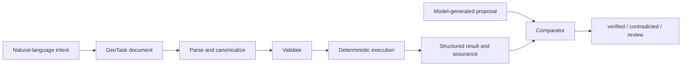

# GeoTask

[简体中文](README.md) | **English**

**Verifiable spatiotemporal task protocol for AI agents.**

[](LICENSE)
[](https://www.python.org/)
[](https://github.com/stpku/GeoTask/actions/workflows/ci.yml)
[](https://stpku.github.io/GeoTask/)
[](https://github.com/stpku/GeoTask/releases)
[](https://pypi.org/project/geotask-core/)

GeoTask turns spatial, temporal, evidential, resource, and action constraints into explicit YAML tasks that both models and programs can read. GeoTask Core then recomputes supported claims with local deterministic operators, so a fluent model response is not mistaken for a verified result.

- **Models propose:** objects, assertions, explanations, and candidate actions.
- **GeoTask Core verifies:** structure, references, operator contracts, deterministic results, and assurance metadata.
- **Applications decide:** whether a result can continue, must be blocked, needs evidence, or requires review.

> A model-generated answer is a proposal. It becomes trustworthy only through an explicit verification path.

## Start here

- [Try the GT01–GT18 experience](https://stpku.github.io/GeoTask/)
- [Quickstart](docs/tutorials/quickstart.md)
- [White Paper v0.1](docs/whitepaper/GeoTask_White_Paper_v0.1.md)
- [Implemented Language and Execution Specification v1.0](docs/spec/geotask-language-spec-v1.0.md)
- [GT01–GT18 Cookbook](docs/cookbook/gt01-gt18.md)
- [v0.1.1 PyPI hotfix release notes](docs/release_v0_1_1.md)
- [Public roadmap](ROADMAP.md)
- [Documentation index](docs/README.en.md)

## Why GeoTask

LLMs can misunderstand coordinates, boundaries, interval semantics, object capabilities, and resource margins. Tool calling solves individual function calls, but it does not by itself preserve task intent, object binding, evidence status, blocked outputs, or resume conditions.

GeoTask provides a task-level intermediate representation:



## Five-minute quickstart

```bash
python -m pip install geotask-core
geotask --help
geotask inspect operators
```

Save this minimal task as `my_distance.yaml`:

```yaml
geotask:
  id: "example"
  schema_version: "1.0"

objects:
  a: {type: "point", coordinates: [0, 0]}
  b: {type: "point", coordinates: [3, 4]}

operator_set: [distance_2d]

tasks:
  - id: "calc"
    assertions:
      - id: "ab"
        operator: "distance_2d"
        object_refs: ["a", "b"]
```

The local executor returns `ab = 5.0 meter` with `assurance_level: local_deterministic`.

```bash
geotask validate my_distance.yaml
geotask run my_distance.yaml
```

## Public application cases

| Stage | Cases | Main question |
|---|---|---|
| Geometry | GT01–GT03 | What spatial relationship is actually true? |
| Space-time composition | GT04–GT06 | Do horizontal, vertical, and temporal conditions all hold? |
| Uncertainty and evidence | GT07–GT09 | What happens when evidence is missing or conflicting? |
| Action and feasibility | GT10–GT18 | What executable action follows from verified spatial, resource, response, live-environment, multi-UAV conflict, city-event deduplication, and equipment-capability constraints? |

Selected examples:

- **GT07:** unknown is not false when a schedule cannot be verified.
- **GT09:** two individually verified no-fly notices can still conflict.
- **GT10:** two robots competing for one corridor need an explicit coordination policy.
- **GT11:** a target 50 meters away may require a 300-meter accessible route.
- **GT12:** enough energy to arrive is not enough to complete a UAV mission safely.
- **GT13:** an open road may still be impassable for a specific vehicle envelope.
- **GT14:** the nearest rescue team may not have the earliest verified arrival or meet the response deadline.
- **GT15:** a structurally passable map corridor may still be occupied by a live obstacle.
- **GT16:** crossing routes and overlapping altitudes do not prove collision when crossing-zone occupancy times are separated.
- **GT17:** ten reports of one incident should create one dispatch task while preserving all ten evidence sources.
- **GT18:** the geometrically shortest route may be unsafe when it crosses a hazard beyond the rescue robot's operating capability.

See the [Cookbook](docs/cookbook/gt01-gt18.md) for all cases and source files.

## Implemented public Core

### Canonical object types

`point`, `polyline`, `rect`, `time_interval`, `altitude_interval`, and `feature_collection`.

`feature_collection` is represented in the Canonical IR; individual operators accept only combinations declared by the operator registry.

### Deterministic operators

| Operator | Inputs | Output |
|---|---|---|
| `distance_2d` | point, point | number |
| `line_intersects_rect` | polyline, rect | boolean |
| `point_to_line_distance_2d` | point, polyline | number |
| `rect_contains_point` | rect, point | boolean |
| `time_overlap` | time interval, time interval | boolean |
| `altitude_overlap` | altitude interval, altitude interval | boolean |

### Execution chain

```text
parse YAML → canonicalize → validate → execute → GeotaskResult
```

The public Core includes YAML parsing, Canonical IR, structured diagnostics, deterministic execution, result assembly, assurance metadata, model-output normalization, local verification, CLI commands, JSON Schema, examples, and conformance tests.

## Workflow semantics in the weekly cases

The cases also demonstrate `unverifiable`, `conflicted`, `blocked`, `evidence_request`, `blocked_outputs`, `resume_when`, and `next_action`. These are application or workflow semantics carried through `extensions`; they must not be confused with every current Core enum.

## Not included in the public Core

- Hosted model execution or API keys
- Production orchestration and model routing
- Industry Domain Packs and customer rules
- Private data connectors and approval thresholds
- Automatic device control
- Patent-sensitive optimization and commercial governance

See [Target Specification Status](docs/spec/target-specification-status.md) and [Open Core Boundary](docs/open_core_commercial_runtime_boundary.md).

## CLI

```bash
geotask validate <file.yaml>
geotask run <file.yaml>
geotask normalize <model-output.txt>
geotask eval <file.yaml> <model-output.txt>
geotask inspect operators
```

## Version map

| Artifact | Current version | Meaning |
|---|---:|---|
| GeoTask Core package | `0.1.1` | Python implementation version |
| GeoTask document schema | `1.0` | YAML/JSON document format |
| Language specification | `1.0` | Implemented public normative profile |
| White paper | `0.1` | Public conceptual draft |

## Documentation

- [English documentation index](docs/README.en.md)
- [中文文档导航](docs/README.md)
- [JSON Schema](schemas/geotask-v1.0.schema.json)
- [Status and Assurance Model](docs/reference/status-model.md)
- [Evidence, Conflict, Blocking, and Recovery](docs/reference/evidence-and-recovery.md)
- [Architecture](docs/architecture.md)
- [Operator extension guide](docs/operator-guide.md)

## Contributing

Read [CONTRIBUTING.md](CONTRIBUTING.md) or [中文贡献指南](CONTRIBUTING.zh-CN.md). Bug reports, operator proposals, documentation improvements, and new application-case ideas are welcome.

Use an editable source install only when contributing to development:

```bash
git clone https://github.com/stpku/GeoTask.git
cd GeoTask
python -m pip install -e ".[dev]"
pytest
```

## License and boundary

GeoTask Core is released under the [MIT License](LICENSE). Public code, specifications, and examples are separate from private Runtime, Domain Packs, customer data, and patent-sensitive implementation details.
