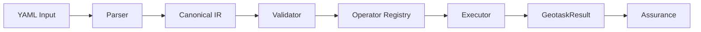

# GeoTask Core

[](https://github.com/stpku/GeoTask/actions/workflows/ci.yml)
[](LICENSE)
[](https://www.python.org/)

[English](README.md) | [简体中文](README.zh-CN.md)

**Explicit inputs, deterministic execution, and inspectable results.**

## What It Does

GeoTask is an open-source project for describing spatial objects and operations in a
YAML format that LLMs can read and reason about. The GeoTask Core Python package
(`geotask-core`) then verifies every computed result using local deterministic
operators. No network calls, no model dependencies. If an LLM claims a distance is
144.22 meters, GeoTask Core computes it locally and confirms or contradicts the claim.

Every result carries an assurance level and a provenance chain, from object
references through operator contracts to deterministic computation. Agent frameworks
can use this as a verifiable spatial reasoning layer.

## 30-Second Demo

```bash
git clone https://github.com/stpku/GeoTask.git
cd GeoTask
pip install -e .
geotask run examples/core/v1_minimal_distance.yaml
```

Output:

```yaml
[run] examples/core/v1_minimal_distance.yaml
measurements:
- name: ab_distance
  value: 5.0
  unit: meter
  object_refs:
  - point_a
  - point_b
  verified_by: distance_2d
  status: verified
conclusion:
  summary: ab_distance=5.0 meter
  external_data_used: false
verified_by:
- operation: distance_2d
  result: '5.00'
```

Two points at (0,0) and (3,4). GeoTask Core computes the Euclidean distance (5.0 m),
marks it verified, and records the exact operator used. Nothing to configure. Nothing
to call.

## Why GeoTask

LLMs are fluent but unreliable with spatial reasoning. They hallucinate distances,
flip coordinates, and misinterpret geometric relationships. GeoTask Core gives agent
pipelines a deterministic check: define the objects, state the assertions, run the
operators, and inspect the output. If a result carries `status: verified`, it was
computed locally by a known operator with a known formula.

## How It Works



1. **Parser** reads the YAML document and builds a structured representation.
2. **Canonical IR** normalizes every document into a versioned intermediate form that
   all downstream stages share.
3. **Validator** checks schema conformance and produces structured diagnostics.
4. **Operator Registry** maps operator names to deterministic implementations.
5. **Execution** dispatches assertions through the registry and collects results.
6. **GeotaskResult** aggregates all measurements, statuses, units, and provenance.
7. **Assurance** assigns a level (`unverified` through `local_deterministic`) so
   callers can decide when to trust a result.

## Install

GeoTask Core is currently installed from source. PyPI distribution is planned for a later release.

```bash
git clone https://github.com/stpku/GeoTask.git
cd GeoTask
pip install -e .
```

Requires Python 3.10+ and PyYAML. Zero GIS dependencies.

## Minimal Example

```yaml
geotask:
  id: "example"
  schema_version: "1.0"

objects:
  a: {type: "point", coordinates: [0, 0]}
  b: {type: "point", coordinates: [3, 4]}

operator_set: [distance_2d]

tasks:
  - id: "calc"
    assertions:
      - id: "ab"
        operator: "distance_2d"
        object_refs: ["a", "b"]
```

## CLI

```bash
geotask validate <file.yaml>       # schema and structure checks
geotask run <file.yaml>            # validate then execute
geotask normalize <output.txt>     # extract structured results from LLM output
geotask eval <file.yaml> <txt>     # compare LLM output against ground truth
geotask explain <file.yaml>        # show how operators resolve
geotask report <file.yaml>         # generate JSON or Markdown report
geotask inspect operators          # list available operators
```

The `stir` command is a deprecated compatibility alias. Use `geotask` instead.

## Objects and Operators

**Object types** (6): `point`, `polyline`, `rect`, `time_interval`, `altitude_interval`, `feature_collection`.

**Operators** (6, all deterministic):

| Operator | Input | Output |
|---|---|---|
| `distance_2d` | point, point | number |
| `line_intersects_rect` | polyline, rect | boolean |
| `point_to_line_distance_2d` | point, polyline | number |
| `rect_contains_point` | rect, point | boolean |
| `time_overlap` | time_interval, time_interval | boolean |
| `altitude_overlap` | altitude_interval, altitude_interval | boolean |

## Use Cases

- **LLM agent pipelines.** Ground spatial claims before acting on them.
- **Benchmark evaluation.** Compare model outputs against deterministic ground truth
  with `geotask eval`.
- **Task encoding.** Describe spatial problems in a machine-readable format that
  both humans and models can inspect.
- **Verification middleware.** Insert GeoTask Core between an LLM and downstream
  systems to catch spatial hallucinations.

## Scope

GeoTask Core is the open-source deterministic execution layer. It provides spatial verification. Orchestration and domain-specific extensions are outside this repository.

For the full boundary, see [docs/open_source_boundary.md](docs/open_source_boundary.md).

## Docs

- [Architecture](docs/architecture.md)
- [Operator Guide](docs/operator-guide.md)
- [CLI Usage](docs/cli_usage.md)
- [YAML Schema Reference](docs/geotask_yaml_schema.md)
- [Open Source Boundary](docs/open_source_boundary.md)
- [Migration Guide](MIGRATION.md)
- [Changelog](CHANGELOG.md)

## Contributing

Bug reports and pull requests are welcome. See [CONTRIBUTING.md](CONTRIBUTING.md)
for dev setup, code style, and the PR process.

## Security

GeoTask Core contains no secrets, keys, or credentials. It is safe to clone, audit,
and redistribute. For reporting vulnerabilities, see [SECURITY.md](SECURITY.md).

## License

MIT. See [LICENSE](LICENSE).
