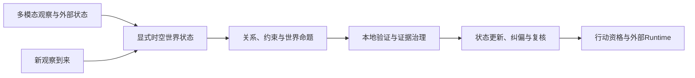

# GeoTask

**简体中文** | [English](README.en.md)

> **面向智能体的可验证时空世界模型**
>
> 让大模型理解世界，让GeoTask验证并维护世界。

[](LICENSE)
[](https://www.python.org/)
[](https://github.com/stpku/GeoTask/actions/workflows/ci.yml)
[](https://stpku.github.io/GeoTask/)
[](https://github.com/stpku/GeoTask/releases)
[](https://pypi.org/project/geotask-core/)

```bash
pip install geotask-core
```

GeoTask把多模态模型、传感器、地图、权威数据和人工输入转化为显式的世界对象、时空关系、状态、证据和行动约束，构建可计算、可验证、可更新、可追溯的时空世界状态。它不是把整个世界隐式压进一个神经网络，而是让智能体依赖的现实事实能够被查看、复算、纠偏和持续维护。

- **多模态模型负责感知与开放推理：** 从文本、地图、图像、视频和状态数据中形成观察、假设与方案；
- **GeoTask Core负责世界状态契约与验证内核：** 显式表达对象、坐标、时间、关系、证据和命题，并用本地确定性路径验证；
- **验证与控制机制负责维护世界：** 保留已证实事实，标记冲突和未知，限定纠偏范围，并管理行动资格；
- **Runtime与Domain Pack负责连接现实：** 接入权威数据、行业规则、本地预测模型、人工复核和生产动作。

> **工程边界：** GeoTask Core提供可验证时空世界模型的公共状态契约、验证内核和Artifact基础；“可验证时空任务协议”是当前实现形式。Observation v0.1表达带来源和不确定性的世界命题，World State v0.1表达可版本化显式快照，Observation Merge Result v0.1按完整显式映射将新命题写入既有状态目标，并对同一目标支持调用方显式声明的语义相等合并或完整优先级选择，生成绑定的后继版本，State Transition v0.1绑定前后快照，Verification Session v0.1固化审计上下文，Discrepancy Report v0.1记录差异及修订范围，Correction Request v0.1约束后继状态变更，Impact Graph v0.1组织可校验的影响DAG，Recompute Derivation Result v0.1从精确来源路径确定性推导受限重算值，World State Materialization Result v0.1记录受限后继状态物化，Incremental Reevaluation Result v0.1则闭合图节点、复核目标、验收条件、差异消解以及输出/动作门禁；自动差异计算、对象身份发现、未声明策略的歧义命题冲突消解、影响图自动发现与传播执行以及通用推导方法仍在持续建设。

## 从这里开始

- [立即体验GT01—GT22](https://stpku.github.io/GeoTask/)
- [5分钟中文入门](docs/tutorials/quickstart.zh-CN.md)
- [GeoTask白皮书v0.1](docs/whitepaper/GeoTask_White_Paper_v0.1.md)
- [白皮书英文摘要](docs/whitepaper/GeoTask_White_Paper_v0.1.md#english-abstract)
- [GT01—GT20中文案例手册](docs/cookbook/gt01-gt20.zh-CN.md)
- [GT21—GT28世界状态循环案例手册](docs/cookbook/gt21-gt28.zh-CN.md)
- [当前实现语言与执行规范v1.0](docs/spec/geotask-language-spec-v1.0.md)
- [Observation v0.1](docs/spec/geotask-observation-v0.1.md)
- [World State v0.1](docs/spec/geotask-world-state-v0.1.md)
- [Observation Merge Result v0.1](docs/spec/geotask-observation-merge-result-v0.1.md)
- [State Transition v0.1](docs/spec/geotask-state-transition-v0.1.md)
- [Verification Session v0.1](docs/spec/geotask-verification-session-v0.1.md)
- [Discrepancy Report v0.1](docs/spec/geotask-discrepancy-report-v0.1.md)
- [Correction Request v0.1](docs/spec/geotask-correction-request-v0.1.md)
- [Impact Graph v0.1](docs/spec/geotask-impact-graph-v0.1.md)
- [Recompute Derivation Result v0.1](docs/spec/geotask-recompute-derivation-result-v0.1.md)
- [World State Materialization Result v0.1](docs/spec/geotask-world-state-materialization-result-v0.1.md)
- [Incremental Reevaluation Result v0.1](docs/spec/geotask-incremental-reevaluation-result-v0.1.md)
- [Agent集成Profile v0.1](docs/spec/geotask-agent-integration-profile-v0.1.md)
- [Runtime接口Profile v0.1](docs/spec/geotask-runtime-interface-profile-v0.1.md)
- [GeoTask Core Agent Skill](skills/geotask-core/SKILL.md)
- [VS Code Schema配置示例](.vscode/settings.json)
- [v0.3.0 Agent集成版发布说明](docs/release_v0_3_0.md)
- [v0.2.0制品契约版发布说明](docs/release_v0_2_0.md)
- [公共路线图](ROADMAP.md)
- [中文文档导航](docs/README.md)

## 智能体为什么需要可验证的世界模型

多模态大模型越来越会看懂场景、调用工具和生成计划，但模型内部的“世界理解”通常隐含在上下文、向量或参数中。进入真实行动前，智能体还需要一个外显、共享、可验证的世界状态，持续回答：

- 世界中有哪些对象，它们在哪里、何时存在、处于什么状态；
- 哪些关系和约束已经成立，哪些仍然未知、冲突或缺少证据；
- 新观察到来后，哪些世界状态和结论需要更新或失效；
- 哪些事实来自模型、传感器、权威数据或人工复核；
- 当前世界状态允许智能体采取什么行动。

一次Tool Calling可以完成局部函数调用，却不会自动维护对象身份、世界快照、证据状态、变化影响和行动边界。GeoTask把这些信息组织为可验证、可审计的世界模型原语与Artifact：


```mermaid
flowchart LR
  O[多模态观察与外部状态] --> W[显式时空世界状态]
  W --> R[关系、约束与世界命题]
  R --> V[本地验证与证据治理]
  V --> U[状态更新、纠偏与复核]
  U --> G[行动资格与外部Runtime]
  N[新观察到来] --> W
```

当前公共Core已经实现世界对象与空间合同、来源与证据绑定、Observation v0.1、World State v0.1、受限Observation Merge v0.1、State Transition v0.1、Verification Session v0.1、Discrepancy Report v0.1、Correction Request v0.1、Impact Graph v0.1、来源绑定的受限重算值推导、受限后继状态物化、Incremental Reevaluation Result v0.1、世界命题、确定性关系验证、控制状态、Agent机械修复和限定路径重试。自动差异计算、对象身份发现、未声明策略的歧义命题冲突消解、Impact Graph自动发现与传播执行和通用推导方法仍属于后续路线图。

## 5分钟运行

```bash
python -m pip install geotask-core
geotask --help
geotask inspect operators
```

将下面的最小任务保存为`my_distance.yaml`：

```yaml
geotask:
  id: "example"
  schema_version: "1.0"

objects:
  a: {type: "point", coordinates: [0, 0]}
  b: {type: "point", coordinates: [3, 4]}

operator_set: [distance_2d]

tasks:
  - id: "calc"
    assertions:
      - id: "ab"
        operator: "distance_2d"
        object_refs: ["a", "b"]
```

本地执行器会得到：

```text
ab = 5.0 meter
assurance_level = local_deterministic
```

```bash
geotask validate my_distance.yaml
geotask run my_distance.yaml
```

## 20个公开应用案例

GeoTask不是只展示几个几何函数，而是通过机器人、无人机、车辆和低空任务，逐步展示模型方案如何被结构化、复算、验错、补证、纠偏和行动门控。

| 阶段 | 案例 | 核心问题 |
|---|---|---|
| 空间关系 | GT01—GT03 | 距离、边界接触和多段路线到底是什么关系？ |
| 时空组合 | GT04—GT06 | 水平、高度和时间条件是否同时成立？ |
| 不确定性与证据 | GT07—GT09 | 缺证据或证据冲突时，系统应该怎么办？ |
| 行动与可行性 | GT10—GT20 | 约束确认以后，下一步具体执行什么？ |

重点案例：

- **GT07：** 时间条件无法核验时，`unknown`不能被偷换成`false`；
- **GT09：** 两份分别已核验的临时禁飞通知仍可能互相冲突；
- **GT10：** 两台机器人抢同一条窄通道，需要显式协调规则；
- **GT11：** 目标只有50米，轮式机器人却可能必须绕行300米；
- **GT12：** 无人机电量够到达，不等于能保留安全余量完成任务；
- **GT13：** 道路开放，不等于具体车辆的安全包络能够通过；
- **GT14：** 距离最近，不等于救援队能够最早到达并满足响应时限；
- **GT15：** 地图结构可通行，不等于机器人当前路线没有被实时障碍占据；
- **GT16：** 初始计划已验证，不等于新遥测到来后可以停止监测；延误使预测间隔从120秒缩至80秒，系统应保留有效结论并准备增量复核；
- **GT17：** 十次上报不等于十起事件，应合并为一个任务并保留十份来源证据；
- **GT18：** 最短路线能够到达目标，不等于它满足环境风险和救援机器人耐受能力约束；
- **GT19：** 无人机到达目标上空，不等于投放区已经净空并获得载荷释放授权；
- **GT20：** 车辆获得绿灯，不等于下游出口净空且能够完整驶离路口；
- **GT21：** 遥测显示延误60秒，运行审核记录显示55秒时，AI不能按到达顺序覆盖、取平均或自行判断来源权威；必须暴露冲突并执行业务方明确声明的规则；
- **GT22：** 无人机的位置和电量来自两个系统时，AI不能简单拼接“最新字段”；必须先确认对象、时间和字段归属，才能形成可追溯的统一运行快照；
- **GT23：** 无人机飞行五分钟后位置和电量都变化时，不能只覆盖最新值；必须保留前后快照，绑定300秒时间差，并明确记录位置、电量和对象有效期变化。

GT01—GT20见[基础案例手册](docs/cookbook/gt01-gt20.zh-CN.md)，GT21—GT28见[世界状态循环案例手册](docs/cookbook/gt21-gt28.zh-CN.md)。

## 当前公共Core真正支持什么

### Canonical对象类型

`point`、`polyline`、`multi_polyline`、`polygon`、`rect`、`time_interval`、`altitude_interval`和`feature_collection`。

其中`feature_collection`已经进入Canonical IR，但具体算子只接受算子注册表中声明的对象组合。

### 九个本地确定性算子

| 算子 | 输入 | 输出 |
|---|---|---|
| `distance_2d` | 点、点 | 数值 |
| `line_intersects_rect` | 折线、矩形 | 布尔值 |
| `multi_polyline_intersects_rect` | 多折线、矩形 | 布尔值 |
| `point_in_polygon` | 点、多边形 | 布尔值 |
| `polygon_contains_point` | 多边形、点 | 布尔值 |
| `point_to_line_distance_2d` | 点、折线 | 数值 |
| `rect_contains_point` | 矩形、点 | 布尔值 |
| `time_overlap` | 时间区间、时间区间 | 布尔值 |
| `altitude_overlap` | 高度区间、高度区间 | 布尔值 |

### 跨任务空间合同

同一文档中的全部任务共享一套CRS、坐标顺序、水平/垂直单位和边界语义。平面算子只接受`local_cartesian`或带标识的`projected`坐标，且坐标顺序必须为`[x, y]`；Core不会把经纬度直接当作欧氏坐标，也不会自动换算单位。距离断言与高度对象必须匹配文档单位；当前边界敏感算子只支持`closed`，声明`open`会失败关闭。纯时间任务不受平面CRS门禁影响。

### 来源、证据与审计

文档可选声明`provenance.sources`、`evidence_bindings`和`audit`。Core严格校验来源ID、类型、URI/Artifact身份、SHA-256、带时区时间、断言绑定和审计引用；通过后将声明的来源ID写入对应`CheckResult.evidence_refs`。该机制不联网获取来源、不重算外部摘要，也不会仅因存在来源元数据而提升Assurance等级。

`geotask inspect schemas --format json`还会为每类公共Artifact返回`ide_file_patterns`，可直接用于VS Code YAML、JetBrains或其他支持JSON Schema文件匹配的IDE配置。

### 公共一致性与性能基准

```bash
geotask benchmark core --enforce-performance --output core-benchmark.json
```

该离线基准使用5个固定虚构案例覆盖全部8个公共确定性算子，并检查结果往返、重复执行语义指纹和Provenance证据绑定；同时测量`JSON解码→Canonical化→验证→执行→序列化`全链路。默认100毫秒p95阈值仅用于发现本机严重性能回归，不是跨硬件排名、生产SLA或模型能力评测。报告可作为`geotask.core-benchmark-report`再次严格验证。

### 执行主链

```text
解析YAML → Canonical IR → 验证 → 执行 → GeotaskResult
```

公共Core已经包含：

- YAML解析与兼容处理；
- Canonical IR；
- 结构化诊断；
- 算子注册与确定性执行；
- 结果汇总和Assurance等级；
- 模型输出归一化；
- 模型结果与本地结果比较；
- Agent工具契约发现、生成草稿机械修复、结构化修订请求、差异约束重试、四类报告Artifact离线验证与GT08补证据恢复；
- CLI、JSON Schema、案例和一致性测试。

## 案例扩展语义

GT07—GT20还展示了：

```text
unverifiable
conflicted
blocked
evidence_request
blocked_outputs
resume_when
next_action
```

这些仍是`extensions`中的控制与工作流语义，而不是基础`ClaimStatus`枚举。当前公共Core已经通过`geotask.control/1.0`对其进行严格校验和只读评估，并支持单一命名条件的补证据后重新执行；恢复过程可输出并离线验证`geotask.agent-evidence-recovery` Artifact。真实证据获取、审批和动作执行仍属于外部Runtime或Domain Pack。

## 当前不包含什么

公共Core不包含：

- 托管大模型调用和模型密钥；
- 生产级任务编排、模型路由和成本治理；
- 行业Domain Pack和客户规则；
- 私有数据连接器、审批阈值和评分模型；
- 自动设备控制；
- 专利敏感优化方法和商业运行逻辑。

详见[目标规范状态](docs/spec/target-specification-status.md)和[开源Core边界](docs/open_core_commercial_runtime_boundary.md)。

## CLI

```bash
geotask validate <file.yaml>
geotask run <file.yaml>
geotask normalize <model-output.txt>
geotask eval <file.yaml> <model-output.txt>
geotask inspect operators
geotask agent inspect --format json
geotask agent prepare <generated.yaml> --repaired-output <prepared.yaml>
geotask agent retry <blocked-report.json> <revised.yaml> --verification-output <verification.json> --prepared-output <prepared.yaml>
geotask agent recover <task.yaml> --evidence <verified-state.yaml> --output <recovery-report.json>
geotask artifact validate geotask.agent-evidence-recovery <recovery-report.json> --format json
geotask runtime inspect examples/core/runtime_reference_descriptor.json --format json
geotask runtime check examples/core/runtime_reference_descriptor.json examples/core/runtime_validate_artifact_request.json --format json
geotask runtime mock examples/core/runtime_validate_artifact_request.json --output runtime-response.json
geotask verify examples/core/verification_session_uav_recheck.json --state examples/core/world_state_uav_separation_recheck.json --observation examples/core/observation_uav_b_delay_recheck.json --bind task-gt16=examples/core/uav_route_crossing_temporal_separation.yaml --bind result-gt16-initial=examples/core/verification_session_uav_execution_result.json --bind transition-uav-recheck=examples/core/state_transition_uav_separation_recheck.json --format json
geotask recheck examples/core/incremental_reevaluation_result_uav_recheck.json --bind base-world-state=examples/core/world_state_uav_separation_recheck.json --bind successor-world-state=examples/core/world_state_uav_separation_successor.json --bind impact-graph-uav-recheck=examples/core/impact_graph_uav_recheck.json --bind correction-uav-recheck=examples/core/correction_request_uav_recheck.json --bind discrepancy-uav-recheck=examples/core/discrepancy_report_uav_recheck.json --bind result-gt16-reevaluation=examples/core/incremental_reevaluation_uav_execution_result.json --format json
```

公共仓还提供[`examples/adapters/http_json_runtime_adapter.py`](examples/adapters/http_json_runtime_adapter.py)，演示如何在`geotask_core`之外把已离线检查的Descriptor绑定到独立HTTP Runtime。配套的[`examples/endpoints/reference_runtime_http_server.py`](examples/endpoints/reference_runtime_http_server.py)可在回环地址启动一个真实HTTP Endpoint，形成Adapter—Endpoint端到端闭环。两者均不在线获取Descriptor、不处理凭据、不重试、不调用模型，也不执行生产动作；传输错误与Runtime状态严格分离，返回结果仍由Core执行Descriptor / Request / Response三方合同校验。

[`examples/model_adapters/provider_neutral/`](examples/model_adapters/provider_neutral/)进一步提供一个可独立构建的Provider-neutral模型Adapter包骨架：定义非秘密配置、结构化Provider Protocol、Mock Provider和`execute-nonlocal`映射，并在调用前验证输入Artifact、调用后验证输出Artifact及模型真实性。它拒绝模型结果冒充`verified`、`local_deterministic`或确定性执行。

[`examples/model_adapters/openai_responses/`](examples/model_adapters/openai_responses/)在此基础上实现首个真实Provider集成：由私有启动代码注入已认证的官方OpenAI SDK客户端，公共包执行一次关闭重试、关闭存储、禁用工具的Responses API严格结构化输出调用，并将结果继续交给Artifact和真实性门禁。仓库测试仅使用模拟SDK客户端，不读取密钥，也不发起线上调用。

## 版本说明

| 名称 | 当前版本 | 含义 |
|---|---:|---|
| GeoTask Core包 | `0.3.0` | Python实现版本 |
| GeoTask文档Schema | `1.0` | YAML/JSON任务格式版本 |
| 语言与执行规范 | `1.0` | 当前公共实现规范 |
| Agent Integration Profile | `0.1` | 模型无关工具契约、补证据恢复与恢复报告Artifact |
| Runtime Interface Profile | `0.1` | Core与外部Runtime之间的Descriptor、Request、Response契约 |
| 白皮书 | `0.1` | 公开概念草案 |

## 文档

- [中文文档导航](docs/README.md)
- [English documentation index](docs/README.en.md)
- [中文快速入门](docs/tutorials/quickstart.zh-CN.md)
- [英文快速入门](docs/tutorials/quickstart.md)
- [GT01—GT20中文案例手册](docs/cookbook/gt01-gt20.zh-CN.md)
- [GT01—GT20 English Cookbook](docs/cookbook/gt01-gt20.md)
- [GT21—GT28世界状态循环案例手册](docs/cookbook/gt21-gt28.zh-CN.md)
- [GT21–GT28 World-State Cycle Cookbook](docs/cookbook/gt21-gt28.md)
- [JSON Schema](schemas/geotask-v1.0.schema.json)
- [状态与可信等级](docs/reference/status-model.md)
- [证据、冲突、阻断与恢复](docs/reference/evidence-and-recovery.md)
- [架构说明](docs/architecture.md)
- [算子扩展指南](docs/operator-guide.md)

## 参与项目

欢迎提交：

- Bug和结构化诊断问题；
- 通用确定性算子建议；
- 文档与中文表达改进；
- 新的机器人、无人机、自动驾驶和城市治理案例；
- 对状态、证据和恢复语义的讨论。

请阅读[中文贡献指南](CONTRIBUTING.zh-CN.md)或[English Contributing Guide](CONTRIBUTING.md)。

参与开发时再使用源码安装：

```bash
git clone https://github.com/stpku/GeoTask.git
cd GeoTask
python -m pip install -e ".[dev]"
pytest
```

## 开源许可与边界

GeoTask Core使用[MIT License](LICENSE)。公开代码、规范和案例，与私有Runtime、Domain Pack、客户数据及专利敏感实现保持明确分离。
