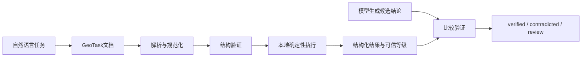

# GeoTask

**简体中文** | [English](README.en.md)

> **面向AI智能体的可验证时空任务协议**

[](LICENSE)
[](https://www.python.org/)
[](https://github.com/stpku/GeoTask/actions/workflows/ci.yml)
[](https://stpku.github.io/GeoTask/)
[](https://github.com/stpku/GeoTask/releases)
[](https://pypi.org/project/geotask-core/)

GeoTask把自然语言中的空间、时间、证据、资源和行动约束转换为结构化任务，并通过本地确定性计算验证模型结果。

- **模型负责提出：** 对象、断言、解释和候选动作；
- **GeoTask Core负责验证：** 结构、引用、算子契约、确定性结果和可信等级；
- **上层应用负责决策：** 继续执行、阻断任务、补充证据或进入人工复核。

> 模型生成的答案只是候选结论。只有经过明确验证路径，才能成为可信结果。

## 从这里开始

- [立即体验GT01—GT15](https://stpku.github.io/GeoTask/)
- [5分钟中文入门](docs/tutorials/quickstart.zh-CN.md)
- [GeoTask白皮书v0.1](docs/whitepaper/GeoTask_White_Paper_v0.1.md)
- [GT01—GT15中文案例手册](docs/cookbook/gt01-gt15.zh-CN.md)
- [当前实现语言与执行规范v1.0](docs/spec/geotask-language-spec-v1.0.md)
- [v0.1.1 PyPI修正版发布说明](docs/release_v0_1_1.md)
- [公共路线图](ROADMAP.md)
- [中文文档导航](docs/README.md)

## 为什么Agent需要GeoTask

大模型擅长理解和生成，却可能在坐标顺序、边界语义、时间区间、高度范围、对象能力和安全余量上产生错误。一次Tool Calling可以完成局部函数调用，但通常不能完整保留：

- 任务要解决什么问题；
- 哪些对象参与计算；
- 对象采用什么单位和坐标参考；
- 哪些结论由模型提出，哪些由本地算子产生；
- 缺少证据时应阻断什么；
- 条件恢复后从哪里继续。

GeoTask提供任务级中间表示：


```mermaid
flowchart LR
  A[自然语言任务] --> B[GeoTask文档]
  B --> C[解析与规范化]
  C --> D[结构验证]
  D --> E[本地确定性执行]
  E --> F[结构化结果与可信等级]
  M[模型生成候选结论] --> G[比较验证]
  F --> G
  G --> H[verified / contradicted / review]
```

## 5分钟运行

```bash
python -m pip install geotask-core
geotask --help
geotask inspect operators
```

将下面的最小任务保存为`my_distance.yaml`：

```yaml
geotask:
  id: "example"
  schema_version: "1.0"

objects:
  a: {type: "point", coordinates: [0, 0]}
  b: {type: "point", coordinates: [3, 4]}

operator_set: [distance_2d]

tasks:
  - id: "calc"
    assertions:
      - id: "ab"
        operator: "distance_2d"
        object_refs: ["a", "b"]
```

本地执行器会得到：

```text
ab = 5.0 meter
assurance_level = local_deterministic
```

```bash
geotask validate my_distance.yaml
geotask run my_distance.yaml
```

## 15个公开应用案例

GeoTask不是只展示几个几何函数，而是通过机器人、无人机、车辆和低空任务，逐步展示AI如何可靠地理解、执行和验证时空任务。

| 阶段 | 案例 | 核心问题 |
|---|---|---|
| 空间关系 | GT01—GT03 | 距离、边界接触和多段路线到底是什么关系？ |
| 时空组合 | GT04—GT06 | 水平、高度和时间条件是否同时成立？ |
| 不确定性与证据 | GT07—GT09 | 缺证据或证据冲突时，系统应该怎么办？ |
| 行动与可行性 | GT10—GT15 | 约束确认以后，下一步具体执行什么？ |

重点案例：

- **GT07：** 时间条件无法核验时，`unknown`不能被偷换成`false`；
- **GT09：** 两份分别已核验的临时禁飞通知仍可能互相冲突；
- **GT10：** 两台机器人抢同一条窄通道，需要显式协调规则；
- **GT11：** 目标只有50米，轮式机器人却可能必须绕行300米；
- **GT12：** 无人机电量够到达，不等于能保留安全余量完成任务；
- **GT13：** 道路开放，不等于具体车辆的安全包络能够通过；
- **GT14：** 距离最近，不等于救援队能够最早到达并满足响应时限；
- **GT15：** 地图结构可通行，不等于机器人当前路线没有被实时障碍占据。

完整案例、源码和学习路径见[中文案例手册](docs/cookbook/gt01-gt15.zh-CN.md)。

## 当前公共Core真正支持什么

### Canonical对象类型

`point`、`polyline`、`rect`、`time_interval`、`altitude_interval`和`feature_collection`。

其中`feature_collection`已经进入Canonical IR，但具体算子只接受算子注册表中声明的对象组合。

### 六个本地确定性算子

| 算子 | 输入 | 输出 |
|---|---|---|
| `distance_2d` | 点、点 | 数值 |
| `line_intersects_rect` | 折线、矩形 | 布尔值 |
| `point_to_line_distance_2d` | 点、折线 | 数值 |
| `rect_contains_point` | 矩形、点 | 布尔值 |
| `time_overlap` | 时间区间、时间区间 | 布尔值 |
| `altitude_overlap` | 高度区间、高度区间 | 布尔值 |

### 执行主链

```text
解析YAML → Canonical IR → 验证 → 执行 → GeotaskResult
```

公共Core已经包含：

- YAML解析与兼容处理；
- Canonical IR；
- 结构化诊断；
- 算子注册与确定性执行；
- 结果汇总和Assurance等级；
- 模型输出归一化；
- 模型结果与本地结果比较；
- CLI、JSON Schema、案例和一致性测试。

## 案例扩展语义

GT07—GT15还展示了：

```text
unverifiable
conflicted
blocked
evidence_request
blocked_outputs
resume_when
next_action
```

这些主要属于案例层或工作流扩展语义，通常放在`extensions`中；它们不能被误写为当前Core已经全部实现的基础枚举。

## 当前不包含什么

公共Core不包含：

- 托管大模型调用和模型密钥；
- 生产级任务编排、模型路由和成本治理；
- 行业Domain Pack和客户规则；
- 私有数据连接器、审批阈值和评分模型；
- 自动设备控制；
- 专利敏感优化方法和商业运行逻辑。

详见[目标规范状态](docs/spec/target-specification-status.md)和[开源Core边界](docs/open_core_commercial_runtime_boundary.md)。

## CLI

```bash
geotask validate <file.yaml>
geotask run <file.yaml>
geotask normalize <model-output.txt>
geotask eval <file.yaml> <model-output.txt>
geotask inspect operators
```

## 版本说明

| 名称 | 当前版本 | 含义 |
|---|---:|---|
| GeoTask Core包 | `0.1.1` | Python实现版本 |
| GeoTask文档Schema | `1.0` | YAML/JSON任务格式版本 |
| 语言与执行规范 | `1.0` | 当前公共实现规范 |
| 白皮书 | `0.1` | 公开概念草案 |

## 文档

- [中文文档导航](docs/README.md)
- [English documentation index](docs/README.en.md)
- [中文快速入门](docs/tutorials/quickstart.zh-CN.md)
- [英文快速入门](docs/tutorials/quickstart.md)
- [中文案例手册](docs/cookbook/gt01-gt15.zh-CN.md)
- [英文Cookbook](docs/cookbook/gt01-gt15.md)
- [JSON Schema](schemas/geotask-v1.0.schema.json)
- [状态与可信等级](docs/reference/status-model.md)
- [证据、冲突、阻断与恢复](docs/reference/evidence-and-recovery.md)
- [架构说明](docs/architecture.md)
- [算子扩展指南](docs/operator-guide.md)

## 参与项目

欢迎提交：

- Bug和结构化诊断问题；
- 通用确定性算子建议；
- 文档与中文表达改进；
- 新的机器人、无人机、自动驾驶和城市治理案例；
- 对状态、证据和恢复语义的讨论。

请阅读[中文贡献指南](CONTRIBUTING.zh-CN.md)或[English Contributing Guide](CONTRIBUTING.md)。

参与开发时再使用源码安装：

```bash
git clone https://github.com/stpku/GeoTask.git
cd GeoTask
python -m pip install -e ".[dev]"
pytest
```

## 开源许可与边界

GeoTask Core使用[MIT License](LICENSE)。公开代码、规范和案例，与私有Runtime、Domain Pack、客户数据及专利敏感实现保持明确分离。
