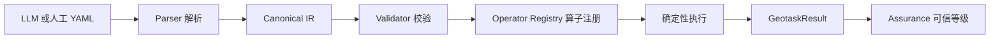

[English](README.md) | [简体中文](README.zh-CN.md)

[](https://github.com/stpku/GeoTask/actions/workflows/ci.yml)
[](LICENSE)
[](https://www.python.org/)

# GeoTask

**GeoTask 是面向大模型与智能体的可验证空间任务表示与确定性执行引擎。**

GeoTask 是一种轻量级 YAML 格式，用于描述空间对象、约束、断言和任务图，使大模型和智能体能够输出可结构化的空间推理方案，并由确定性本地算子进行验证。

---

## 命名说明

| 名称 | 含义 |
|------|------|
| **GeoTask** | 项目名称和 GitHub 仓库名称 |
| **GeoTask Core** | 开源 Python 核心包 |
| `geotask-core` | PyPI 包名 |
| `geotask` | 推荐 CLI 命令 |
| `stir` | 仅历史兼容入口，不建议新用户使用 |

---

## GeoTask 做什么

- 将自然语言空间请求转换为显式空间任务（对象、约束、断言）
- 以结构化、LLM 可读的 YAML 描述空间问题
- 由确定性本地算子精确计算空间结果
- 模型输出通过归一化和验证流程与确定性计算结果比对
- 每个计算结果携带 assurance level，明确区分模型生成与确定性验证

---

## 30 秒快速开始

```bash
git clone https://github.com/stpku/GeoTask.git
cd GeoTask
pip install -e .
geotask validate examples/core/v1_minimal_distance.yaml
geotask run examples/core/v1_minimal_distance.yaml
```

输出：

```yaml
measurements:
- name: ab_distance
  value: 5.0
  unit: meter
  object_refs: [point_a, point_b]
  verified_by: distance_2d
  status: verified
```

---

## 为什么需要 GeoTask

大模型可以进行空间推理，但其输出往往：

- 数值不精确
- 对象引用模糊
- 约束遗漏
- 无法自验证
- 缺少可信度量

GeoTask 提供统一的从输入到验证的完整链路，让空间推理变得可验证。

---

## 处理链路



---

## 安装

GeoTask Core 当前通过源码安装。PyPI 分发计划在后续版本提供。

```bash
git clone https://github.com/stpku/GeoTask.git
cd GeoTask
pip install -e .
pip install pytest  # 测试用
```

依赖仅 [PyYAML](https://pypi.org/project/PyYAML/)，零 GIS 框架依赖。

---

## 最小示例

```yaml
geotask:
  id: "minimal-distance"
  name: "最小距离示例"
  schema_version: "1.0"

space:
  crs: { type: "local_cartesian", identifier: "local_xy_m" }
  horizontal_unit: "meter"

objects:
  point_a:
    type: "point"
    coordinates: [0, 0]
  point_b:
    type: "point"
    coordinates: [3, 4]

tasks:
  - id: "compute_distance"
    assertions:
      - id: "ab_distance"
        operator: "distance_2d"
        object_refs: ["point_a", "point_b"]
        unit: "meter"

execution:
  mode: "local_only"
  steps:
    - id: "calc"
      executor: "local"
      assertion_refs: ["ab_distance"]

output_contract:
  format: "structured"
  required_fields: ["ab_distance"]
```

---

## CLI 用法

```bash
geotask validate <file.yaml>    # 校验文档
geotask run <file.yaml>         # 校验并执行
geotask normalize <model.txt>   # LLM 输出归一化
geotask eval <yaml> <output>    # 模型对比评测
geotask inspect operators       # 查看算子列表
```

---

## 对象类型

| 类型 | 说明 |
|------|------|
| `point` | 二维点 |
| `polyline` | 折线（所有连续点对均为有效线段） |
| `rect` | 轴对齐矩形 |
| `time_interval` | 时间区间 |
| `altitude_interval` | 高度区间 |
| `feature_collection` | 要素集合 |

---

## 确定性算子（当前 6 个）

| 算子 | 输入 | 输出 |
|------|------|------|
| `distance_2d` | point + point | number |
| `line_intersects_rect` | polyline + rect | boolean |
| `point_to_line_distance_2d` | point + polyline | number |
| `rect_contains_point` | rect + point | boolean |
| `time_overlap` | time_interval + time_interval | boolean |
| `altitude_overlap` | altitude_interval + altitude_interval | boolean |

---

## 典型场景

- **LLM 空间推理验证**：大模型输出 → GeoTask 归一化 → 确定性验证
- **Agent 空间任务表示**：结构化描述对象的空间约束和断言
- **确定性空间计算**：无需 GIS 框架即可运行的轻量级本地计算
- **模型输出评测**：确定性计算结果作为 Ground Truth 进行评分
- **空间断言的回归测试**

---

## 项目边界

GeoTask Core 是完整可运行的开源确定性空间任务验证引擎。模型编排、数据连接器和行业扩展不属于本仓库范围。

**GeoTask 不是：**

- GIS 数据库或地图渲染引擎
- LLM 编排框架
- 行业审批系统

---

## 文档导航

| 文档 | 说明 |
|------|------|
| [architecture](docs/architecture.md) | 架构设计 |
| [operator-guide](docs/operator-guide.md) | 如何注册新算子 |
| [cli_usage](docs/cli_usage.md) | CLI 详细用法 |
| [geotask_yaml_schema](docs/geotask_yaml_schema.md) | YAML Schema |
| [open_source_boundary](docs/open_source_boundary.md) | 开源与商业边界 |
| [MIGRATION](MIGRATION.md) | STIR → GeoTask 迁移指南 |
| [CONTRIBUTING](CONTRIBUTING.md) | 贡献指南 |
| [SECURITY](SECURITY.md) | 安全报告 |
| [CHANGELOG](CHANGELOG.md) | 变更日志 |

---

## 贡献

欢迎提交 Issue 和 Pull Request。详见 [CONTRIBUTING.md](CONTRIBUTING.md)。

## 安全

发现安全漏洞请勿公开提交 Issue，详见 [SECURITY.md](SECURITY.md)。

## 许可证

MIT License — 详见 [LICENSE](LICENSE)。
