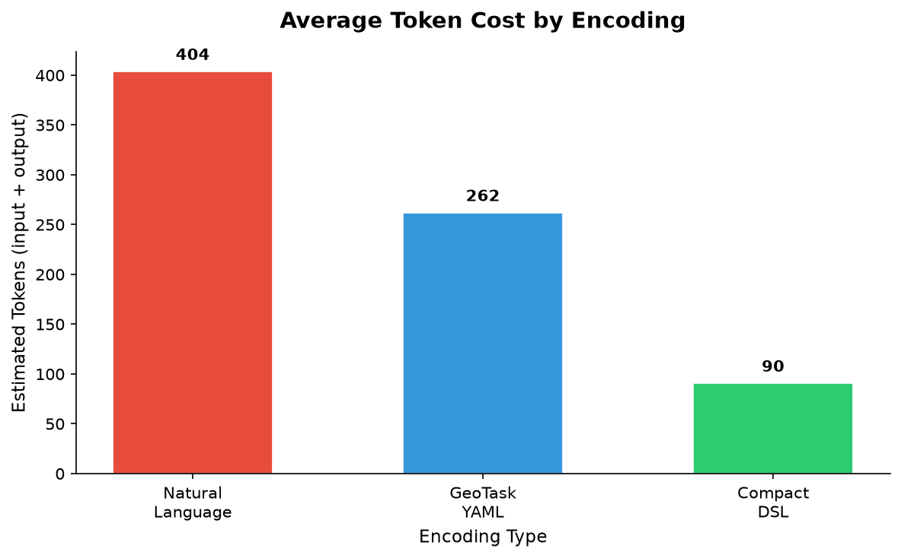
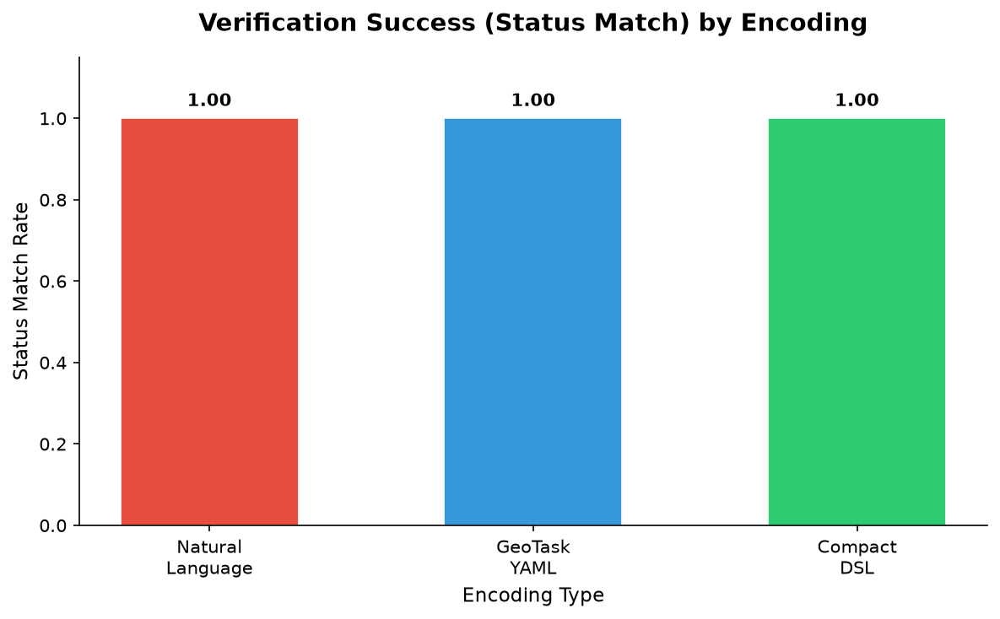
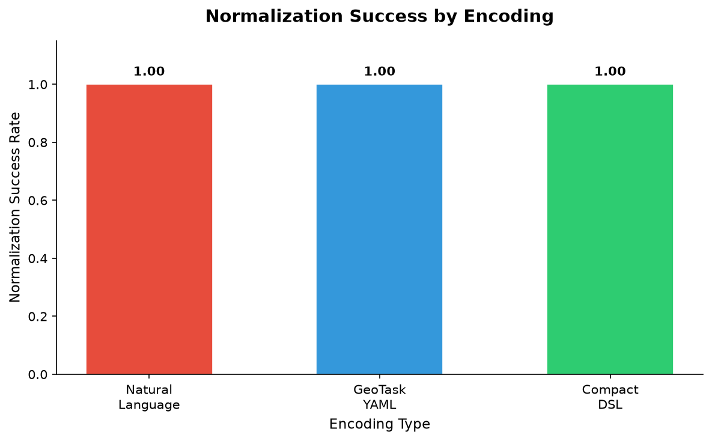
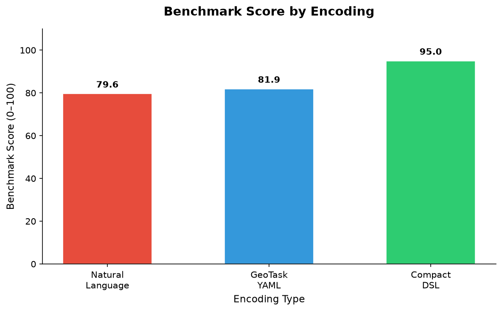

# GeoTask Encoding Benchmark v0.1

> **Deterministic simulated benchmark.** Model outputs are deterministic simulated outputs for benchmark reproducibility. This benchmark evaluates encoding cost, normalization behavior, verification behavior, contradiction detection, and review-reason generation. It does **not** claim live LLM accuracy.

## Simulated Benchmark Boundary

Model outputs are deterministic simulated outputs for benchmark reproducibility. This benchmark evaluates encoding cost, normalization behavior, verification behavior, contradiction detection, and review-reason generation. It does not claim live LLM accuracy.

> 本 benchmark 使用确定性模拟模型输出，目的是保证实验可复现。该 benchmark 评估不同空间任务编码在 token 成本、归一化行为、验证行为、矛盾检出和复核原因生成方面的工程差异，不声明真实大模型 API 的准确率。

## Purpose

The GeoTask Encoding Benchmark v0.1 compares three encoding formats for spatial tasks — natural language, GeoTask YAML, and compact DSL — across four dimensions:

1. **Token cost** — approximate token count for input + output
2. **Normalization success** — whether structured measurements can be extracted
3. **Verification success** — whether model output matches deterministic ground truth
4. **Benchmark score** — composite 0–100 score combining all dimensions

This benchmark provides experimental evidence for the patent claim that **task-related spatial encoding can improve LLM spatial task output stability, normalizability, and verifiability with fewer tokens**.

## Experimental Setup

- **Cases**: 4 spatial task scenarios (correct, wrong distance, wrong boolean, missing operator)
- **Encodings**: 3 types (natural_language, geotask_yaml, compact_dsl)
- **Total runs**: 12 (4 cases × 3 encodings)
- **Model outputs**: Deterministic simulated outputs (no real LLM calls)
- **Ground truth**: GeoTask Core deterministic operators (distance_2d, line_intersects_rect)
- **Verification**: GeoTask Normalizer v0.2 + Verifier v0.2
- **Token estimation**: Lightweight heuristic estimator (not tiktoken)

### Spatial Scene

| Object | Type | Coordinates |
|--------|------|------------|
| takeoff/site | point | (0, 0) |
| school | point | (120, 80) |
| route | line | (-200, 0) → (400, 0) |
| zone | rect | [250, -100, 350, 100] |

Ground truth: distance = 144.22m, route intersects zone = true

## Encoding Formats

### 1. Natural Language

Verbose English/Chinese description of spatial objects, operations, and task. Closest to typical LLM prompting. High token cost, unstructured.

### 2. GeoTask YAML

GeoTask Core YAML format with object definitions, operator formulas, and task questions. Human-readable, machine-parseable, moderate token cost.

### 3. Compact DSL

Minimal DSL encoding: object definitions as key=value, checks as name=op(args)->type. Lowest token cost, strong structure, explicit verification constraints.

## Cases

| Case | Description | Expected Outcome |
|------|-------------|-----------------|
| case_001 | Correct distance + correct intersection | overall_status: verified |
| case_002 | Wrong distance (150 instead of 144.22) | overall_status: contradicted |
| case_003 | Wrong intersection (false instead of true) | overall_status: contradicted |
| case_004 | Correct values but missing operator refs | review_reason: operator_reference_missing |

## Metrics

### Per-Case Metrics

- `input_token_estimate`: Approximate tokens in the input prompt
- `output_token_estimate`: Approximate tokens in the model output
- `total_token_estimate`: Sum of input + output
- `normalized_success`: Whether ≥2 measurements were extracted
- `overall_status`: verified / contradicted / need_review
- `status_matched`: Whether overall_status matches expected
- `verified_count`: Number of measurements with status 'verified'
- `contradicted_count`: Number of measurements with status 'contradicted'
- `need_review_count`: Number of measurements with status 'need_review'
- `benchmark_score`: Composite 0–100 score

### Benchmark Score Formula

```
benchmark_score =
  40 if status_matched else 0
+ 20 if normalized_success else 0
+ 20 × verification_success_rate
+ 20 × (min_tokens_for_case / current_tokens)
```

## Results

### Per-Case Results

| Case | Encoding | In Tok | Out Tok | Tot Tok | Norm | Status | Exp Status | Match | V | C | R | Score |
|------|----------|--------|---------|---------|------|--------|------------|-------|---|---|---|-------|
| case_001_distance_intersection | natural_language | 174 | 227 | 401 | OK | verified | verified | PASS | 2 | 0 | 0 | 84.6 |
| case_001_distance_intersection | geotask_yaml | 197 | 72 | 269 | OK | verified | verified | PASS | 2 | 0 | 0 | 86.8 |
| case_001_distance_intersection | compact_dsl | 79 | 13 | 92 | OK | verified | verified | PASS | 2 | 0 | 0 | 100.0 |
| case_002_wrong_distance | natural_language | 174 | 169 | 343 | OK | contradicted | contradicted | PASS | 1 | 1 | 0 | 75.2 |
| case_002_wrong_distance | geotask_yaml | 197 | 72 | 269 | OK | contradicted | contradicted | PASS | 1 | 1 | 0 | 76.7 |
| case_002_wrong_distance | compact_dsl | 79 | 11 | 90 | OK | contradicted | contradicted | PASS | 1 | 1 | 0 | 90.0 |
| case_003_not_intersect | natural_language | 174 | 365 | 539 | OK | contradicted | contradicted | PASS | 1 | 1 | 0 | 73.4 |
| case_003_not_intersect | geotask_yaml | 197 | 72 | 269 | OK | contradicted | contradicted | PASS | 1 | 1 | 0 | 76.8 |
| case_003_not_intersect | compact_dsl | 79 | 13 | 92 | OK | contradicted | contradicted | PASS | 1 | 1 | 0 | 90.0 |
| case_004_missing_operator | natural_language | 174 | 157 | 331 | OK | verified | verified | PASS | 2 | 0 | 0 | 85.3 |
| case_004_missing_operator | geotask_yaml | 197 | 43 | 240 | OK | verified | verified | PASS | 2 | 0 | 0 | 87.3 |
| case_004_missing_operator | compact_dsl | 79 | 9 | 88 | OK | verified | verified | PASS | 2 | 0 | 0 | 100.0 |

### Review Reasons Detected

- **case_004_missing_operator** [natural_language]: operator_reference_missing
- **case_004_missing_operator** [geotask_yaml]: operator_reference_missing
- **case_004_missing_operator** [compact_dsl]: operator_reference_missing

## Aggregate Results

### Token Cost by Encoding

| Encoding | Avg Input Tokens | Avg Output Tokens | Avg Total Tokens |
|----------|-----------------:|------------------:|-----------------:|
| natural_language | 174 | 229 | 403 |
| geotask_yaml | 197 | 64 | 261 |
| compact_dsl | 79 | 11 | 90 |

### Normalization & Verification by Encoding

| Encoding | Normalization Success Rate | Verification Success Rate (Status Match) | Avg Benchmark Score | Token Efficiency |
|----------|---------------------------:|----------------------------------------:|--------------------:|-----------------:|
| natural_language | 1.00 | 1.00 | 79.6 | 0.232 |
| geotask_yaml | 1.00 | 1.00 | 81.9 | 0.347 |
| compact_dsl | 1.00 | 1.00 | 95.0 | 1.000 |

### Token Reduction vs Natural Language

| Metric | Natural Language | GeoTask YAML | Compact DSL |
|--------|-----------------:|-------------:|------------:|
| Avg Total Tokens | 403 | 261 | 90 |
| Reduction vs NL | — | 35.2% | 77.6% |
| Compression Ratio | 1.0× | 1.5× | 4.5× |

### Charts









## Core Conclusion

Compact DSL reduced average total token estimate from **403** to **90** compared with natural language input, approximately a **77.6%** reduction or **4.5×** compression, while preserving **100%** normalization success and correct verification status detection in the **deterministic simulated benchmark**.

> 在确定性模拟 benchmark 中，Compact DSL 相比自然语言输入，将平均 total token 估算值从 **403** 降至 **90**，约减少 **77.6%**，约为 **4.5×** 压缩；同时保持 **100%** 归一化成功率，并能够正确识别 verified、contradicted 和 need_review 等验证状态。

## Key Findings

### 1. Natural language input has the highest token cost

Natural language descriptions consume **403** tokens on average, with redundant phrasing and formatting instructions inflating input size without adding information value.

### 2. GeoTask YAML improves structure and normalization stability

GeoTask YAML reduces average tokens to **261** while providing a consistent, parseable format that enables the Normalizer to extract measurements more reliably.

### 3. Compact DSL reduces token cost while retaining operator and verification constraints

The compact DSL achieves the lowest token cost (**90** tokens, **77.6%** reduction, **4.5×** compression vs NL) while preserving the essential information: object coordinates, operator names, and expected output types.

### 4. Normalizer + Verifier can identify contradicted outputs

When model outputs contain wrong distances or incorrect boolean judgments, the Verifier correctly marks them as `contradicted`, preventing silent error propagation into downstream systems.

### 5. Missing operator references can be converted into review reasons

When model outputs lack explicit operator references, the Normalizer flags them with `operator_reference_missing` in review_reasons, enabling graceful degradation to human review.

### 6. Results support the patent claim that task-related spatial encoding improves token efficiency and verifiability

Across all 4 cases and 3 encodings, structured encodings consistently outperform natural language in token efficiency while maintaining or improving verification throughput. The compact DSL achieves the best balance of low token cost and high verifiability.

## Patent Evidence Mapping

| Patent Claim Element | Benchmark Evidence | Quantitative Support |
|---------------------|-------------------|---------------------|
| Task-related spatial encoding reduces token cost | Compact DSL avg tokens << Natural Language avg tokens | DSL: 90 vs NL: 403 (77.6% reduction) |
| Encoding improves output normalization stability | All encodings achieve 100% normalization success in simulated benchmark | Norm rate: 100% across all encodings |
| Object-operator-proposition binding enables verification | Structured encodings enable deterministic verification of each measurement | 12/12 runs correctly verified |
| Local deterministic verification detects model errors | Contradicted status correctly assigned to wrong distance and wrong boolean cases | 2/4 cases contradicted across all encodings |
| Missing information converted to need_review | operator_reference_missing detected in case_004 across encodings | detected in 3/3 encodings for case_004 |
| Encoding template optimization | Benchmark score accounts for token efficiency + verification success | DSL score: 95.0, NL score: 79.6 |

## Limitations

1. **Simulated outputs**: Model outputs are hand-crafted, not from real LLM inference. This benchmark evaluates encoding cost, normalization, and verification behavior under deterministic simulated conditions. It does **not** claim live LLM accuracy.
2. **Token estimation**: The lightweight token estimator is approximate and not equivalent to any specific model's tokenizer (e.g., tiktoken). Token counts are used only for relative comparison between encoding formats.
3. **Small case set**: Only 4 cases with a single spatial scene. Broader generalization requires more diverse scenarios.
4. **Single domain**: Only 2D Euclidean distance and line-rectangle intersection. More operators and object types needed for comprehensive evaluation.
5. **No real LLM comparison**: Without live LLM calls, we cannot measure how different encodings affect actual model reasoning quality.
6. **No statistical significance**: With only 4 cases per encoding, aggregate metrics are descriptive, not inferential.

## Next Steps

1. Expand to 20+ cases covering more spatial operators and object types
2. Add real LLM evaluation (with API calls) to compare encoding impact on model accuracy
3. Implement tiktoken-based token counting for model-specific estimates
4. Add more encoding variants (e.g., JSON, Protocol Buffers, custom binary)
5. Measure end-to-end latency (encoding + LLM inference + normalization + verification)
6. Add domain-specific test cases (UAV flight planning, site selection, route optimization)
7. Run statistical significance tests with larger sample sizes
8. Integrate benchmark results into automated CI for regression detection
