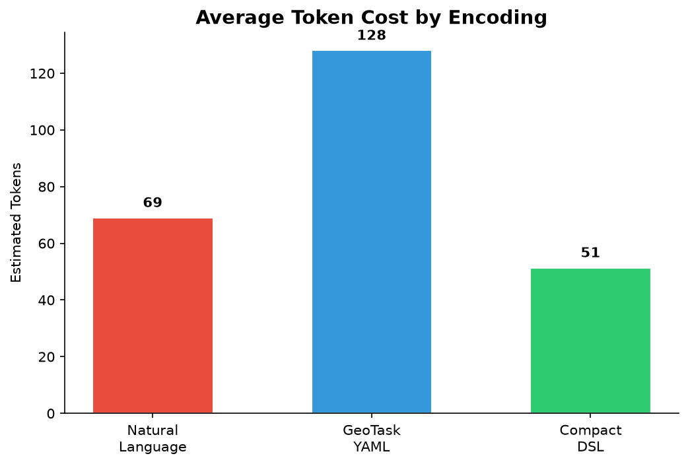
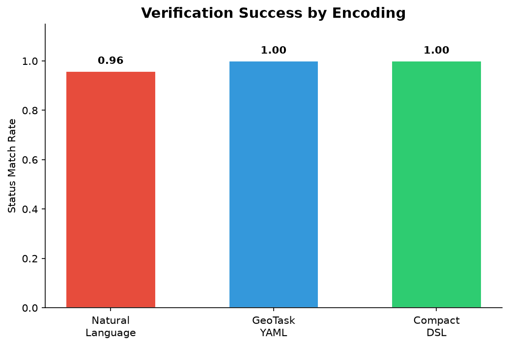
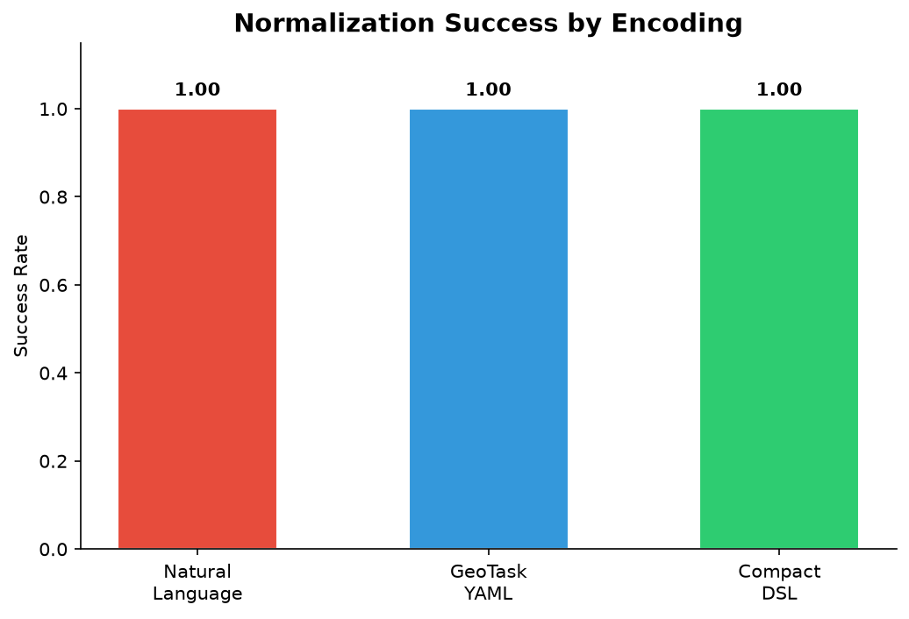
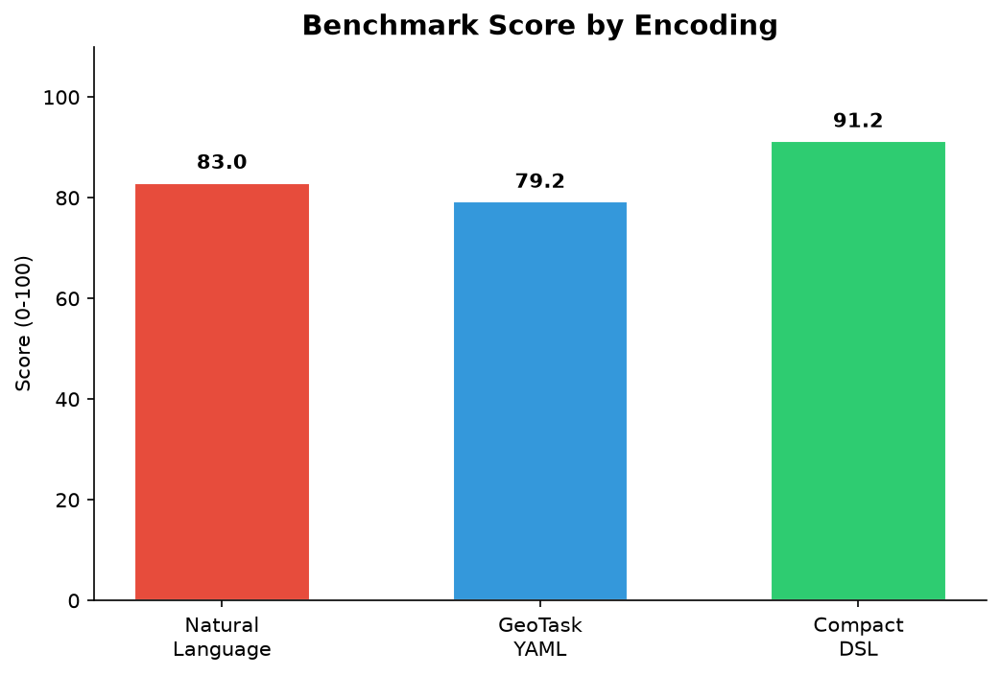
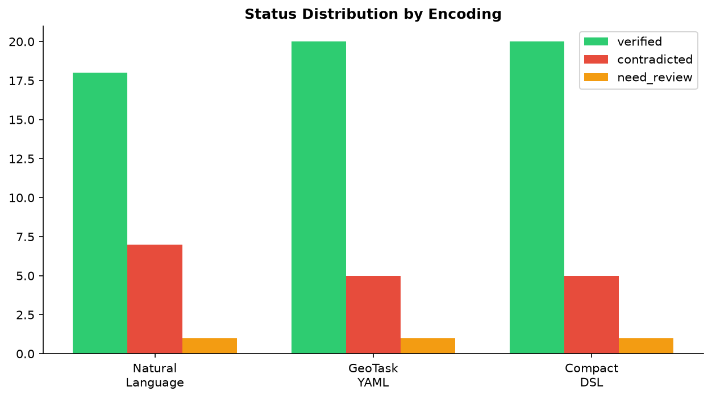
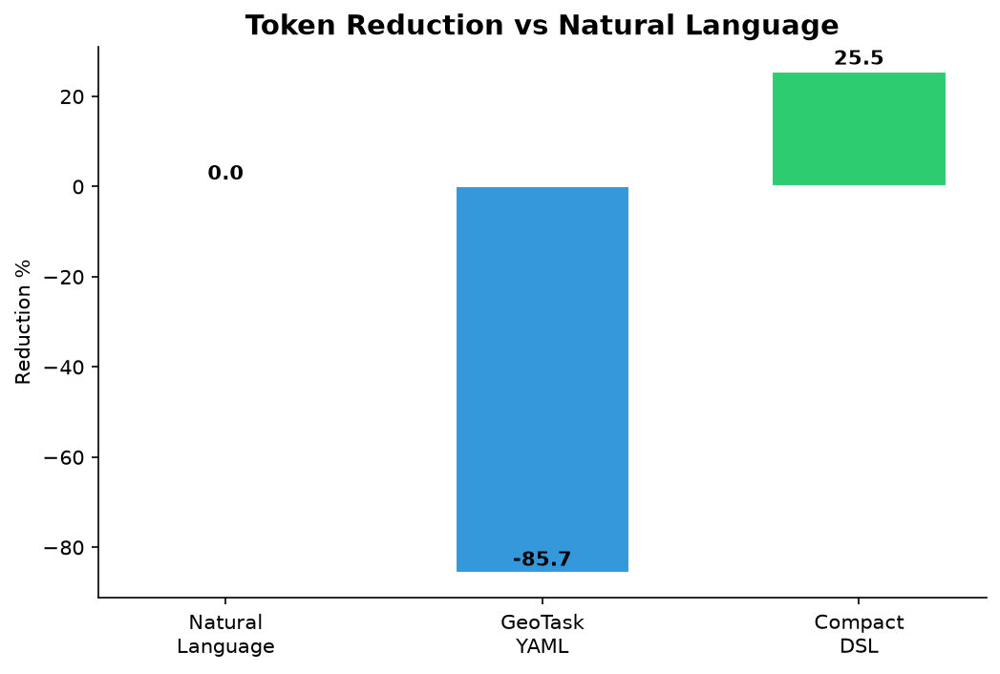

# GeoTask Encoding Benchmark v0.2

> **Deterministic simulated benchmark.** Does not claim live LLM accuracy.

## Difference from v0.1

- Cases: 4 → 24
- Operators: 2 → 6
- Groups: 5 (basic, new ops, contradicted, need_review, robustness)

## Key Findings

Compact DSL reduced avg tokens from 69 to 51 (25.5% reduction, 1.3x compression) vs natural language.

## Aggregate Results

| Encoding | Avg Tokens | Norm Rate | Status Match | Score |
|----------|-----------|-----------|-------------|-------|
| natural_language | 69 | 1.00 | 0.96 | 83.0 |
| geotask_yaml | 128 | 1.00 | 1.00 | 79.2 |
| compact_dsl | 51 | 1.00 | 1.00 | 91.2 |

## Case Group Success

- basic_correct: 100%
- new_operators: 100%
- contradicted: 100%
- need_review: 100%
- robustness: 92%

## Charts

## Limitations
- Simulated outputs, not real LLM
- Approximate token counting
- 24 cases, descriptive only
