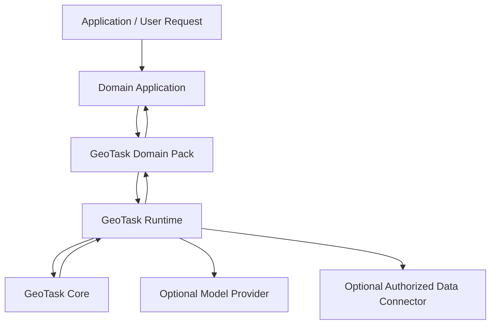

# GeoTask Product Architecture v0.1

## Product Vision

GeoTask Core provides **lightweight spatial task representation and deterministic verification** for LLMs. GeoTask Runtime provides **commercial orchestration, governance, and model integration**. GeoTask Domain Pack provides **industry-specific object models, rules, and workflow customization**.

GeoTask Core 提供面向大模型的轻量级空间任务表达与确定性验证。GeoTask Runtime 提供商业化编排、治理和模型集成。GeoTask Domain Pack 提供行业专用对象模型、规则和工作流定制。

Together, these three layers form a product architecture where the open Core enables adoption, the private Runtime enables commercial value, and pluggable Domain Packs enable industry verticalization.

---

## Product Layers



**Layer summary:**

| Layer | Scope | License | Repository |
|-------|-------|---------|------------|
| GeoTask Core | Spatial task format, operators, normalizer, verifier, CLI | MIT (open source) | `src/geotask_core/` (this repo) |
| GeoTask Runtime | Task orchestration, model adapter, governance, cost control | Proprietary (private) | Separate private repo |
| GeoTask Domain Pack | Industry object models, rules, templates, data connectors | Proprietary (private) | Per-industry private repos |

---

## Core Layer

**Status:** Implemented (v0.1-lite through v0.3).

**Code path:** `src/geotask_core/`

The Core layer is the lightweight foundation. It defines:

| Capability | Module | Description |
|------------|--------|-------------|
| Spatial task format | `models.py`, `parser.py` | YAML-based task schema with `geotask`, `space`, `objects`, `ops`, `task` sections |
| Object types | `models.py` | `point`, `line`, `rect` — universal geometric primitives |
| Object-operator-proposition binding | `runner.py` | Links spatial objects to deterministic operators and task questions |
| 6 deterministic spatial operators | `ops.py` | `distance_2d`, `line_intersects_rect`, `point_to_line_distance_2d`, `rect_contains_point`, `time_overlap`, `altitude_overlap` |
| Normalizer | `normalizer.py` | Extracts structured measurements from unstructured LLM text output (YAML, Markdown, natural language) |
| Verifier | `verifier.py` | Compares normalized LLM output against deterministic operator results; unified status hierarchy (`invalid_operator` > `invalid_reference` > `contradicted` > `need_review` > `verified`) |
| Status machine | `result_schema.py` | Status constants, reason codes, `overall_status` computation |
| Evaluator | `evaluator.py` | Scoring rubric comparing Core ground truth with normalized model output |
| CLI | `cli.py` | `geotask validate`, `geotask run`, `geotask normalize`, `geotask eval` |
| Basic SDK | `__init__.py` | Importable Python package: `from geotask_core import parser, ops, runner` |

**Design constraints (see [`design_principles.md`](design_principles.md)):**

- No heavy dependencies beyond PyYAML
- No model calling, no API keys, no network access
- No database drivers, no platform features
- No domain-specific objects or rules

---

## Runtime Layer

**Status:** Future capability. Not implemented in this repository.

The Runtime layer wraps Core and adds commercial orchestration:

| Capability | Description |
|------------|-------------|
| Task parsing | Accepts user intent (natural language, structured API) and maps it to GeoTask Core task format |
| Encoding template selection | Chooses between natural language, GeoTask YAML, or compact DSL encoding based on task characteristics *(patent-sensitive — details not disclosed)* |
| Token budget planning | Allocates token budgets across task decomposition steps *(patent-sensitive — details not disclosed)* |
| Task-related context filtering | Filters relevant spatial context from large data sets before model invocation |
| Model provider adapter | Pluggable adapter for OpenAI, DeepSeek, Qwen, Claude, and other model APIs |
| Model calling strategy | Retry, fallback, multi-model consensus *(patent-sensitive — details not disclosed)* |
| Candidate spatial content generation | Invokes model(s) to generate spatial reasoning output |
| Verifiability triage | Classifies model output into verifiable vs. non-verifiable claims before full verification |
| Task orchestration | Multi-step task decomposition, dependency resolution, parallel execution |
| Result aggregation | Combines results from multiple sub-tasks into unified response |
| Result audit records | Immutable trace of every model call, verification step, and governance decision |
| Cost and quota control | Per-tenant token budgets, rate limits, usage tracking |

**The Runtime does not exist in the open source Core repository.** It is a separate private codebase. Core has no dependency on Runtime.

---

## Domain Pack Layer

**Status:** Future capability. Architecture defined here; implementation private.

A Domain Pack extends Runtime with industry-specific capabilities:

| Capability | Description |
|------------|-------------|
| Industry object models | Domain-specific spatial object types (e.g., flight corridors, facility footprints, network towers) |
| Industry operator mapping | Maps domain concepts to Core operators and extends with industry-specific operators |
| Industry rules | Regulatory constraints, safety margins, compliance thresholds |
| Task templates | Pre-built task templates for common industry workflows |
| Domain scoring models | Industry-specific quality and risk scoring |
| Workflow templates | Multi-step industry processes with approval gates |
| Data connector interfaces | Adapters for industry data sources (GIS databases, regulatory APIs, facility registries) |
| Report templates | Structured output formatting for industry reporting requirements |
| Human review rules | Escalation criteria, manual verification checkpoints |

### Example Domain Packs

| Pack | Industry | Key Capabilities |
|------|----------|-----------------|
| LowAlt Site Precheck Pack | Low-altitude economy / UAV operations | Airspace clearance checks, obstacle analysis, takeoff/landing site evaluation, regulatory buffer zones |
| Facility Siting Pack | Infrastructure planning | Site selection scoring, proximity analysis, environmental constraint evaluation, accessibility assessment |
| Network Spatial Optimization Pack | Telecommunications / logistics | Coverage optimization, facility placement, route planning, capacity-distance tradeoffs |
| Urban Space Risk Pack | Urban planning / public safety | Spatial risk scoring, crowd density analysis, emergency access evaluation, hazard proximity assessment |

---

## Data and Model Boundary

Core has **zero coupling** to external models, APIs, or databases:

```
┌────────────────────────────────────────────────────┐
│                    Core Layer                       │
│  - Pure Python, deterministic, no network I/O      │
│  - Input: YAML files, text files                   │
│  - Output: structured results, status codes        │
│  - No LLM API keys, no model calls                 │
│  - No database connections                         │
│  - Only dependency: PyYAML                         │
└────────────────────────────────────────────────────┘
          ↑ used by (no reverse dependency)
┌────────────────────────────────────────────────────┐
│                  Runtime Layer                      │
│  - Calls Core operators for verification           │
│  - Manages model provider connections              │
│  - Manages authorized data source connections      │
│  - Handles credentials, tokens, quotas             │
└────────────────────────────────────────────────────┘
          ↑ extended by
┌────────────────────────────────────────────────────┐
│                Domain Pack Layer                   │
│  - Provides industry objects, rules, templates     │
│  - Connects industry data sources via Runtime      │
│  - Never calls Core directly; goes through Runtime │
└────────────────────────────────────────────────────┘
```

---

## Execution Flow

A typical request flows through the stack as follows:

1. **User request** arrives at the Domain Application
2. **Domain Pack** interprets the request using industry templates and maps it to a GeoTask task
3. **Runtime** receives the task, selects encoding strategy, plans token budget
4. **Runtime** optionally retrieves context from authorized data connectors
5. **Runtime** invokes model provider(s) to generate spatial reasoning
6. **Runtime** passes model output to **Core** normalizer for extraction
7. **Core** verifier runs deterministic operators against normalized results
8. **Runtime** applies governance rules (audit, cost tracking, verifiability triage)
9. **Runtime** returns verified results to **Domain Pack**
10. **Domain Pack** applies industry scoring, formatting, and human review rules
11. **Domain Application** presents results to user

---

## Deployment Topology

| Deployment Mode | Core | Runtime | Domain Pack | Use Case |
|----------------|------|---------|-------------|----------|
| Local CLI | Bundled | None | None | Developer evaluation, academic research |
| Single-tenant cloud | Container | Container | Container(s) | Small-team commercial deployment |
| Multi-tenant platform | Shared | Shared with tenant isolation | Per-tenant selection | SaaS platform |
| On-premise | Customer infra | Customer infra | Customer-selected packs | Enterprise / regulated industries |

---

## Security and Privacy Boundary

| Boundary | Responsibility |
|----------|---------------|
| Core | No secrets, no credentials, no PII. Operates on geometric data only. |
| Runtime | Manages model API keys, data connector credentials, tenant tokens. Encrypted at rest and in transit. |
| Domain Pack | May access industry-specific PII or regulated data. Access controlled by Runtime governance. Data never stored in Core. |
| Audit trail | Runtime records all model calls and verification results. Immutable log. Per-tenant isolation. |
| Model provider | Runtime communicates with model providers over TLS. No raw user data forwarded unless explicitly authorized. |

---

## Product Interfaces

| Interface | Provider | Consumer | Type |
|-----------|----------|----------|------|
| GeoTask YAML format | Core | Runtime, external tools, LLMs | File / string |
| Core Python SDK | Core (`src/geotask_core/`) | Runtime, evaluators, scripts | Python import |
| Core CLI | Core (`cli.py`) | Developers, CI/CD | Command line |
| Runtime API | Runtime | Domain Applications, Domain Packs | REST / gRPC |
| Runtime SDK | Runtime | Domain Pack plugins | Python Protocol |
| Domain Pack Protocol | Runtime | Domain Pack implementations | Python Protocol |
| Data Connector Interface | Runtime | External data sources | Adapter pattern |
| Model Provider Adapter | Runtime | LLM APIs | Adapter pattern |

---

## Commercialization Boundary

| Aspect | Core (Open) | Runtime (Commercial) | Domain Pack (Commercial) |
|--------|-------------|---------------------|-------------------------|
| License | MIT | Proprietary | Proprietary |
| Revenue model | None (adoption driver) | Subscription / usage-based | Per-pack license / project-based |
| Target user | Developers, researchers | Platform operators | Industry customers |
| Competitive moat | Community + standard setting | Orchestration IP + governance | Domain expertise + data integration |
| Patent relevance | Format + verification method | Orchestration + planning methods | Industry application methods |

**The commercial value chain:** Core creates adoption → Runtime monetizes orchestration → Domain Packs monetize industry verticalization.

---

## Relationship to Patent Portfolio

| Patent Scope | Relevant Layer(s) |
|-------------|-------------------|
| Spatial task representation method | Core |
| Object-operator-proposition binding | Core |
| Deterministic verification of LLM spatial output | Core + Runtime |
| Output normalization from unstructured LLM text | Core |
| Encoding strategy selection *(patent-sensitive)* | Runtime |
| Token budget planning *(patent-sensitive)* | Runtime |
| Model routing and consensus *(patent-sensitive)* | Runtime |
| Task orchestration for spatial reasoning | Runtime |
| Industry-specific spatial task workflow | Domain Pack |

Open-sourcing Core under MIT does **not** waive patent rights on the underlying methods. See [`patent_boundary.md`](patent_boundary.md).

---

## Current Limitations

| Limitation | Impact | Expected Resolution |
|-----------|--------|-------------------|
| Core supports 3 object types only (point, line, rect) | Cannot represent polygons, circles, 3D volumes | Future Core extensions |
| Core operates in 2D local coordinates only | No real-world CRS, no projection | Future Core + Domain Pack |
| Runtime is not yet implemented | No model calling, no orchestration, no governance | Phase 2 roadmap |
| Domain Packs are architecture only | No industry deployment possible | Phase 3 roadmap |
| Single-file task input only | Cannot handle multi-document task sets | Future Runtime capability |
| No streaming or async execution | Batch processing only | Future Runtime capability |
| 6 operators only | Limited spatial reasoning vocabulary | Incremental Core extension |

---

*Document version: v0.1 | Date: 2025-06-18 | Status: Initial architecture definition*
